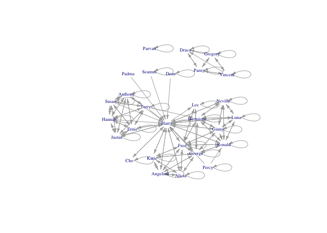
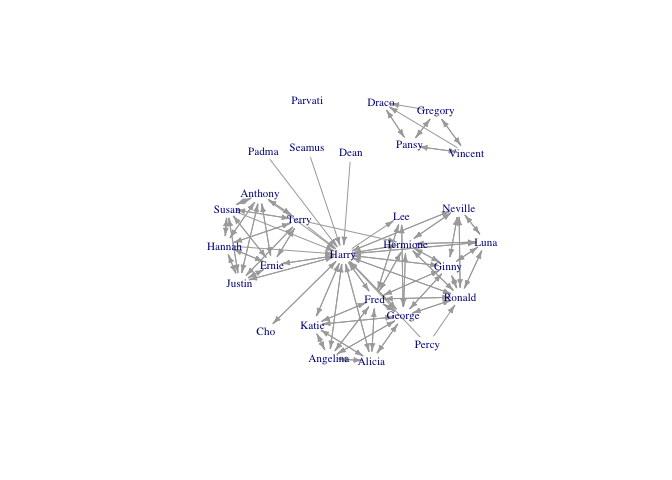
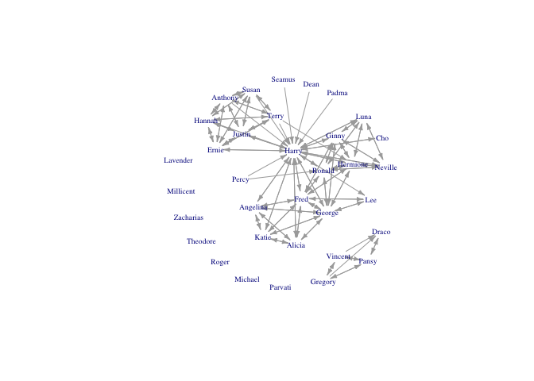
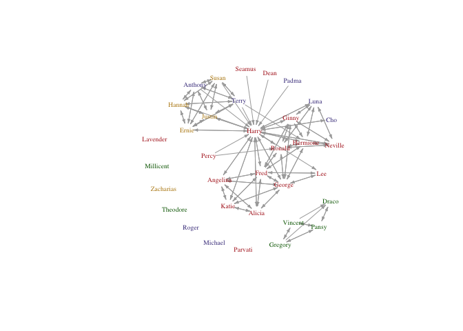
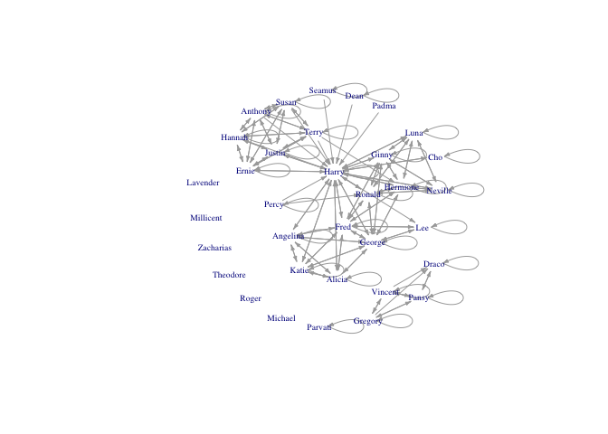

## Importing network data into R

-   [Edgelists](#edgelists)
    -   [Creating your edgelist](#creating-your-edgelist)
    -   [Importing an edgelist](#importing-an-edgelist)
    -   [Loading up individual attributes](#loading-up-individual-attributes)
-   [Sociomatrices](#sociomatrices)
-   [From affiliation data to a network (bipartite networks)](#from-affiliation-data-to-a-network-bipartite-networks)
-   [The `intergraph` package](#the-intergraph-package)

Back to [main page](README.md).

------------------------------------------------------------------------

Getting your network data into the right format to analyze it can be a surprisingly difficult task that is not often addressed in social network analysis textbooks and courses. Here we go over some of the basics of formatting and importing network data.

For this tutorial, we use networks of support between Hogwarts students, as coded by [Bossart and Meidert (2013)](http://file.scirp.org/Html/4-2310131_33365.htm). Their data for the first six Harry Potter books are available to download [here](http://www.stats.ox.ac.uk/~snijders/siena/HarryPotterData.html). These unvalued networks contain a directed tie between two Hogwarts students if one student provided verbal support to the other. We've reformatted the data to illustrate a couple different methods for formatting and handling data. Download our version of the [student attribute data](hpindividuals.csv), the [book five edgelist](hp5edgelist.txt), and the [book five sociomatrix](hp5matrix.txt).

We work through concepts and code using `igraph`, then provide code at the end to show how to get the same data into `statnet` using the `intergraph` package. We don't discuss entity resolution or data cleaning at this juncture; here we focus on how to format your data so that you can represent it as a network.

### Edgelists

An **edgelist** is usually formatted as a table where the first two columns contain the IDs of a pair of nodes in the network that have a tie between them. Optional additional columns may contain properties of the relationship between the nodes (e.g., the value of a tie). Any pair of nodes that does not have a tie between them is usually not included in an edgelist. This property is what makes edgelists a more efficient network data storage format than sociomatrices (see below). Unobserved edges can be encoded in edgelist format by including "NA" in the value column. Here's an example of a simple edgelist table with a value column:

| Ego      | Alter    |  Value|
|:---------|:---------|------:|
| Harry    | Hermione |      5|
| Harry    | Ron      |      6|
| Hermione | Ron      |      5|

The columns in an edgelist table are usually ordered "Ego" (often the person who completed the interview or who was the subject of a focal follow) followed by "Alter" (the person that the focal individual named or interacted with). In the case of undirected network data, the ordering of these columns does not matter, but in directed data, it does. `igraph` and `statnet` software will encode directed edgelist data with the arrow pointing from the first to the second column, so if the ties you recorded have reversed directionality from ego to alter (e.g., the alter gave something to ego) you should flip the order of the columns before converting the data to a network in order to get the edges properly directed (if you want your network to show the direction that support flows in the network). Most directed ties are straightforward to interpret but sometimes it gets complicated, depending on your research design.

The final column in our imaginary edgelist contains a value for the edge. It might be the number of years the pair have known each other, or some measure of the strength or quality of their relationship.

#### Creating your edgelist

A critical first step in constructing an edgelist is to ensure that all individuals in the dataset have unique identifiers. Note that names, even first and last names together, are frequently not unique identifiers, even in relatively small communities. Using some form of ID number or a code generated using a combination of individual characteristics (e.g., initials, location, last four digits of their telephone number) is safer. Implementing a good system for obtaining uniquely identifying information about both egos and alters at the beginning of data collection is important for avoiding serious entity resolution problems later on.

To code up an edgelist from fieldnotes or other unstructured datasets, each time you find a tie between two individuals, simply enter a row with their ID numbers into the edgelist, in the correct order. If the same two individuals are observed to interact multiple times (which may or may not be possible depending on your study design), the best procedure is to record an additional edge in your edgelist everytime that interaction is observed, and to maintain an additional column with the date and/or time the interaction was observed, or some other identifying information. It is easy to aggregate or remove these duplicates in `R` at later stages.

Here's a few examples of supportive interactions between Hogwarts students, and how I would code them up as support ties:

-   "Oh, yes," said Luna \[to Harry\], "I've been able to see them since my first day here. They've always pulled the carriages. Don't worry. You're just as sane as I am." Chapter 10, p. 180
-   "Harry, you're the best in the year at Defence Against the Dark Arts, " said Hermione. Chapter 15, p. 292
-   "That was quite good," Harry lied, but when she \[Cho\] raised her eyebrows he said, "Well, no, it was lousy, but I know you can do it properly, I was watching from over there." Chapter 18, p. 350

| From               | To                 |  Chapter|  Page|
|:-------------------|:-------------------|--------:|-----:|
| Luna Lovegood      | Harry James Potter |       10|   180|
| Hermione Granger   | Harry James Potter |       15|   292|
| Harry James Potter | Cho Chang          |       18|   350|

The columns "Chapter" and "Page" might not be necessary for any analysis I want to do, but they help me find the original data again in the future, in case I needed to double check somehing, and they also allow me to distinguish duplicate ties between characters. If I were coding such data for a real project, I would probably also record some details about the specific nature and context of the interaction.

A similar procedure could be used to code up networks from field notes, although, obviously, you will have to make careful decisions about how to classify interactions, and about how you are sampling interactions among individuals. Such decisions should usually be made *a priori* (ideally with the benefit of a pilot study). If you are encoding relations that you view as constituting different networks, the easiest solution is usually to maintain separate edgelists for each type of relation.

As a sidenote here, we cannot stress enough how important your sampling of interactions in a network is to the conclusions that you can draw from the data. For example, although the Harry Potter data we're examining here is a complete sample of student support interactions in the books, if this were a real ethnographic study of support ties among students in a school, the data would have a severe sampling bias. This is because this dataset only contains interactions among individuals that occur in the presence of Harry Potter. We don't know what the students might say to each other when Harry isn't around; so we can almost be certain that this network will show that Gryffindors are more supportive of each other than Slytherins are. Slytherins might actually be very supportive of each other, but because we've only sampled what Harry experiences, the sample is biased towards interactions between Gryffindors and of course, interactions with Harry himself. Although this may seem like a silly example, this is actually an important point to remember for any fieldworker planning to construct networks from observational data. How do your research participants (human or otherwise) interact when you're not around? Like Harry Potter, you are the centre of your own universe and the interactions you observe may not be a representative sample. You need to carefully design your study and sampling strategy to address these potential biases (see [Altmann 1974](https://www.jstor.org/stable/4533591) for a great discussion of these issues).

Finally, if your network data comes from a name generator or other survey-based network data collection method, it should be straightforward to generate an edgelist---the main difficulty with these methods is usually entity resolution.

#### Importing an edgelist

Usually, you will save your edgelist as a tab- or comma-delimited file (.txt or .csv) and then import it to `R`.

``` r
hp5edges <- read.table("hp5edgelist.txt", sep="\t", header=TRUE)

#take a look
head(hp5edges)
```

    ##             From                 To
    ## 1 Alicia Spinnet     Alicia Spinnet
    ## 2 Alicia Spinnet   Angelina Johnson
    ## 3 Alicia Spinnet       Fred Weasley
    ## 4 Alicia Spinnet     George Weasley
    ## 5 Alicia Spinnet Harry James Potter
    ## 6 Alicia Spinnet         Katie Bell

``` r
#convert to an igraph network
hp5edgesmat <- as.matrix(hp5edges) #igraph wants our data in matrix format
hp5net <- graph_from_edgelist(hp5edgesmat, directed=TRUE)

#extract first names from list of names to make nicer labels. 
##FYI this is insane R notation to extract elements from a list, fear not if you don't get it
firsts <- unlist(lapply(strsplit(V(hp5net)$name,  " "), '[[', 1))

#let's take a look
plot(hp5net, vertex.shape="none", vertex.label.cex=0.6, edge.arrow.size=0.4, vertex.label=firsts, layout=layout.kamada.kawai)
```



Nice. Harry is in the centre of the network, as we might expect. But there are lots of self-loops that make the graph hard to read. It's great that Hogwarts students seem to support themselves, but I am more interested in when they support others.

**Removing loops**

The function `simplify()` in `igraph` handily removes self-loops from a network.

``` r
hp5netsimple <- simplify(hp5net)
plot(hp5netsimple, vertex.shape="none",vertex.label.cex=0.7, edge.arrow.size=0.4, vertex.label=firsts, layout=layout.kamada.kawai)
```



**Adding isolates not in the edgelist**

A flaw in the edgelist format is that nodes that are isolates are not listed in the edgelist. So, if the network contains isolates, these must be added afterwards. There are several characters who appear in Book 5 who do not have any ties in the network:

``` r
book5isolates <- c("Lavender Brown", "Millicent Bulstrode", "Michael Corner", 
                   "Roger Davies", "Theodore Nott", "Zacharias Smith")

hp5netfull <- add_vertices(hp5netsimple, nv=length(book5isolates), attr=list(name=book5isolates))
#note that here we add as many vertices as in our list of isolates, and assign them the attribute "name" which is stored in our list of isolates

#regenerate our list of first names to update it to include these new characters
firsts <- unlist(lapply(strsplit(V(hp5netfull)$name,  " "), '[[', 1))

plot(hp5netfull, vertex.shape="none", vertex.label.cex=0.6, edge.arrow.size=0.4, vertex.label=firsts, layout=layout.kamada.kawai)
```



**Duplicate ties**

A common problem (or feature) of edgelists is that the same edges may be present more than once. For instance, you might have observed two monkeys groom each other on multiple occasions, and recorded each occurrence separately; or, if you interviewed both the ego and alter, the same tie might appear more than once (e.g., Ron said he was friends with Harry, and Harry reported the same thing).

If you just want to remove duplicate edges, you can use the same `simplify()` functions used above to remove self-loops. But, you might prefer to count the number of times an edge appeared and use it as an edge value.

Let's add some duplicate edges to our Book 5 edgelist, then use the `aggregate()` functions to count occurrences.

``` r
hp5newedges <- data.frame(rbind(hp5edges, 
                                c("Harry James Potter", "Ronald Weasley"), 
                                c("Ronald Weasley", "Harry James Potter"), 
                                c("Hermione Granger", "Ronald Weasley"), 
                                c("Hermione Granger", "Harry James Potter"), 
                                c("Hermione Granger", "Harry James Potter")))

#this takes a list of ones and takes the sum of them for each unique row in the edgelist
hp5edgeweights <- aggregate(list(count=rep(1,nrow(hp5newedges))), hp5newedges, FUN=sum)

#take a look at the edges that appear more than once
hp5edgeweights[which(hp5edgeweights$count>1),]
```

    ##                X.From.              X.To. count
    ## 81    Hermione Granger Harry James Potter     3
    ## 88      Ronald Weasley Harry James Potter     2
    ## 139 Harry James Potter     Ronald Weasley     2
    ## 140   Hermione Granger     Ronald Weasley     2

``` r
#create a network and assign the counts as an edge weight
hp5netweight <- graph_from_edgelist(as.matrix(hp5edgeweights[,1:2]), directed=TRUE)
E(hp5netweight)$weight <- hp5edgeweights$count
```

Then you can proceed to remove self-loops and add isolates, as before; and use the edge weight attribute in plotting and analysis.

#### Loading up individual attributes

Normally, in addition to your edgelist (and possibly, edge values) you will have a table of attributes for the nodes in your network; variables like age and gender, for example. Loading these data is just like importing any other data in `R`:

``` r
attributes <- read.csv("hpindividuals.csv", header=TRUE)
head(attributes)
```

    ##   id                   name schoolyear gender house
    ## 1 12         Demelza Robins       1993      2     1
    ## 2  3       Angelina Johnson       1989      2     1
    ## 3 34            Lucian Bole       1988      1     4
    ## 4 13         Dennis Creevey       1994      1     1
    ## 5 56         Ronald Weasley       1991      1     1
    ## 6 28 Justin Finch-Fletchley       1991      1     2

This table appears to contain individuals who are not in the Book 5 network. Let's use the `%in%` operator to extract just the individuals in the Book 5 network from our attributes dataframe.

``` r
book5students <- attributes[attributes$name %in% V(hp5netfull)$name,]

#then reorder the attributes to match the order that the individuals appear as network vertices
book5students <- book5students[match(V(hp5netfull)$name, book5students$name), ]

#now we can simply assign the dataframe columns as vertex attributes, e.g., 
V(hp5netfull)$house <- book5students$house

#but let's use a factor to get nice colours
housecolours <- c("firebrick", "darkgoldenrod", "darkslateblue", "darkgreen")
V(hp5netfull)$housecolours <-as.character(factor(book5students$house, levels=1:4, labels=housecolours))

plot(hp5netfull, vertex.shape="none", vertex.label.color=V(hp5netfull)$housecolours, vertex.label.cex=0.6, edge.arrow.size=0.3, vertex.label=firsts, layout=layout.kamada.kawai)
```



Cool!

### Sociomatrices

Network data may also be formatted as a **sociomatrix**, which is a square matrix where the rows and columns represent individuals in the network and the cell values represent the ties between them (valued or 0/1 for unvalued). In general, it is impractical to record data in this format. In most cases, trying to record data in a sociomatric means you will be constantly scrambling to add more columns and rows that will be mostly filled with zeroes. The storage requirements for a sociomatrix increase with the square of the number of observed vertices in your network, even if most of the entries in the sociomatrix are zero (as they typically are for even moderately-sized populations). Much better to maintain a list of individuals and edges as they appear.

Sociomatrices are more useful when there is a non-zero value in most cells (i.e., the data are not sparse). Such is the case when the relationship between nodes involves some kind of distance metric (e.g., physical distance between households or relatedness coefficients). Distance matrices like these are often important covariates of other networks (e.g., relatedness and physical distance often correlate with ties of support between individuals), but you will not usually generate such matrices by hand. Instead, you will likely generate distance matrices in `R` or some other software program using calculations based off other data (e.g., latitude and longitude coordinates).

Here's how to import a sociomatrix (and get it correctly lined up with your attribute data).

``` r
#read in data
hp5df <- read.table("hp5matrix.txt", sep="\t", header=FALSE) #note that this file has no row or column names

#inspect it
head(hp5df)
```

    ##                                                                                                                                V1
    ## 1 0 0 0 0 0 0 0 0 0 0 0 0 0 0 0 0 0 0 0 0 0 0 0 0 0 0 0 0 0 0 0 0 0 0 0 0 0 0 0 0 0 0 0 0 0 0 0 0 0 0 0 0 0 0 0 0 0 0 0 0 0 0 0 0
    ## 2 0 1 1 0 0 0 0 0 0 0 0 0 0 0 0 0 0 0 1 1 0 0 0 0 1 0 0 0 1 0 0 0 0 0 0 0 0 0 0 0 0 0 0 0 0 0 0 0 0 0 0 0 0 0 0 0 0 0 0 0 0 0 0 0
    ## 3 0 1 1 0 0 0 0 0 0 0 0 0 0 0 0 0 0 0 1 1 0 0 0 0 1 0 0 0 1 0 0 0 0 0 0 0 0 0 0 0 0 0 0 0 0 0 0 0 0 0 0 0 0 0 0 0 0 0 0 0 0 0 0 0
    ## 4 0 0 0 1 0 0 0 0 0 0 0 0 0 0 0 0 1 0 0 0 0 0 0 1 1 0 0 1 0 0 0 0 0 0 0 0 0 0 0 0 0 0 0 0 0 0 0 0 0 0 0 0 0 0 0 0 0 0 0 1 1 0 0 0
    ## 5 0 0 0 0 0 0 0 0 0 0 0 0 0 0 0 0 0 0 0 0 0 0 0 0 0 0 0 0 0 0 0 0 0 0 0 0 0 0 0 0 0 0 0 0 0 0 0 0 0 0 0 0 0 0 0 0 0 0 0 0 0 0 0 0
    ## 6 0 0 0 0 0 0 0 0 0 0 0 0 0 0 0 0 0 0 0 0 0 0 0 0 0 0 0 0 0 0 0 0 0 0 0 0 0 0 0 0 0 0 0 0 0 0 0 0 0 0 0 0 0 0 0 0 0 0 0 0 0 0 0 0

``` r
dim(hp5df)
```

    ## [1] 64  1

Uh-oh, `R` thinks our data frame has only one column. That's not right. Taking a look at the data in a spreadsheet viewer suggests maybe this dataset is formatted differently. Let's try a different separator when we read in the data.

``` r
#read in data
hp5df <- read.table("hp5matrix.txt", sep=" ", header=FALSE) 

#inspect
dim(hp5df) #much better
```

    ## [1] 64 64

Now the data are loaded correctly but we still have a problem. This sociomatrix has dimensions of 64x64, meaning there are 64 students in the network, but from before, we know that only 34 students actually appear in Book 5. This discrepancy is because Bossart and Meidert included all students who appeared in support relationships in ANY of the first six books so that they could do a temporal analysis. I'd prefer just to look at the students who appear in Book 5, so I need to remove these other students.

``` r
#start by adding row and column names to our sociomatrix
#we know from context that the students in this sociomatrix are ordered by ID number
studentsIDs <- sort(attributes$id) #get an ordered list of students IDS
colnames(hp5df) <- rownames(hp5df) <- studentsIDs #assign them as row/col names of the sociomatrix

#extract out the students based on our list of individuals from Book 5
hp5only <- hp5df[book5students$id, book5students$id]
#note that this operation conveniently put the students in the same order as our attributes table from before

#now we can make our network
hp5mat <- as.matrix(hp5only)
hp5net2 <- graph_from_adjacency_matrix(hp5mat)

#get first names again
firsts2 <- unlist(lapply(strsplit(as.character(book5students$name),  " "), '[[', 1))

plot(hp5net2, vertex.shape="none", vertex.label.cex=0.6, edge.arrow.size=0.3, vertex.label=firsts2, layout=layout.kamada.kawai)
```



Now we can proceed as before to remove self-loops and assign attributes.

### From affiliation data to a network (bipartite networks)

Sometimes networks may be generated from data on the presence or absence of individuals at certain place or time. Such data should normally be formatted as an affiliation matrix, where individuals appear in the rows and events/places/times in the columns, with values in the cells filled out as appropriate (did the individual attend the event or not). To convert an affiliation (person-by-event) matrix to a person-to-person network, simply multiply the affiliation matrix by its transpose. See the [Introduction to igraph](intro-igraph.md) tutorial for an example.

Before doing this though, carefully consider what an affiliation matrix means in terms of relationships between persons. Not all group, place, or event affiliations correspond to relationships between persons that are meaningful with respect to your research question.

### The `intergraph` package

The `intergraph` package allows you to convert network objects from `igraph` to `network` (i.e., `statnet`) format and vice versa as well as to or from formats used by other network platforms such as pajek. I often end up using both `igraph` and `statnet` when I'm working with a network dataset, because different centrality measures are implemented in them, and also because sometimes a network just looks better plotted using one package rather than the other.

``` r
library(intergraph)

detach("package:igraph") #don't use igraph and statnet at the same time, they have many functions with the same names
library(statnet)

hp5network <- asNetwork(hp5netfull)
hp5network
```

    ##  Network attributes:
    ##   vertices = 34 
    ##   directed = TRUE 
    ##   hyper = FALSE 
    ##   loops = FALSE 
    ##   multiple = FALSE 
    ##   bipartite = FALSE 
    ##   total edges= 133 
    ##     missing edges= 0 
    ##     non-missing edges= 133 
    ## 
    ##  Vertex attribute names: 
    ##     house housecolours vertex.names 
    ## 
    ## No edge attributes

Easy-peasy. Note that `igraph` does not support network level attributes (indicated with `%n%` in statnet). So, if you convert an object from `statnet` to `igraph` you will lose these. Edge and vertex attributes are carried over, however.
