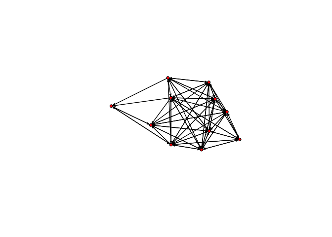
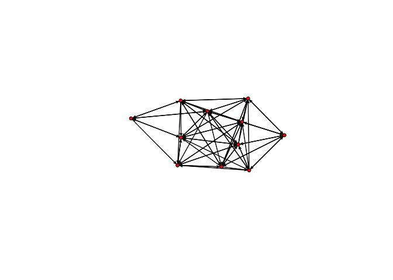
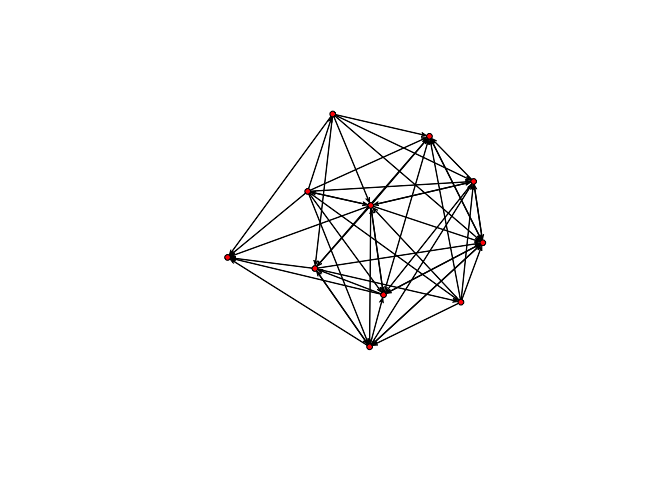
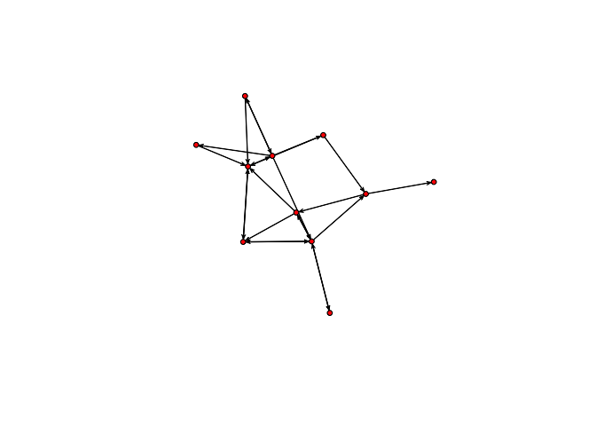
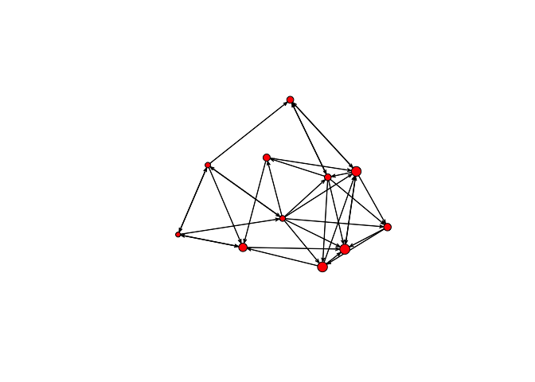
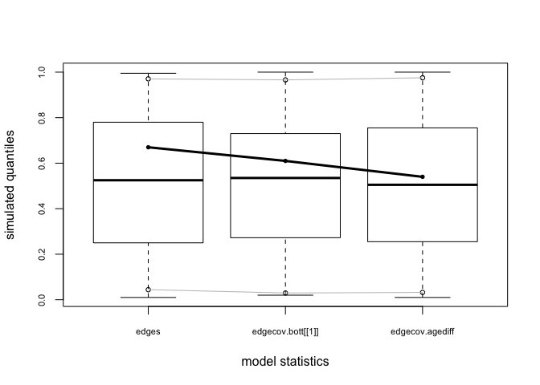
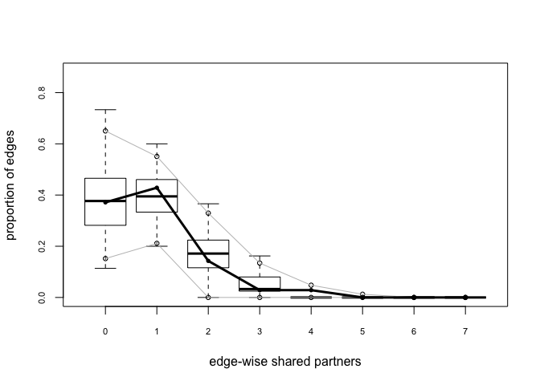
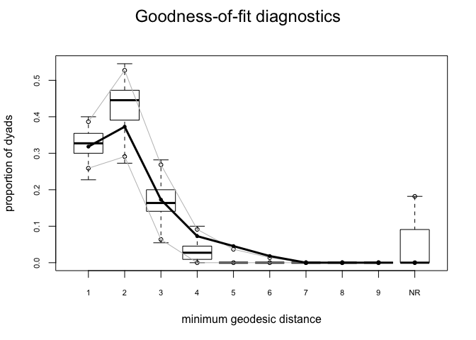
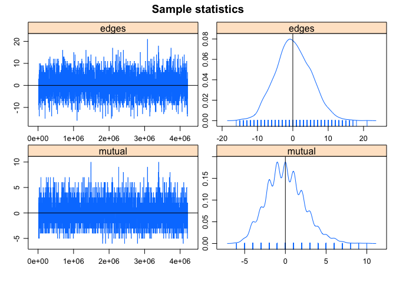

-   [What is an ERGM?](#what-is-an-ergm)
-   [Why not use standard regression methods?](#why-not-use-standard-regression-methods)
    -   [Some practical reasons](#some-practical-reasons)
    -   [Theoretical reasons](#theoretical-reasons)
-   [What is a random graph?](#what-is-a-random-graph)
-   [ERGMs](#ergms)
    -   [Some Definitions and Notation](#some-definitions-and-notation)
-   [Getting Started](#getting-started)
    -   [The Allure of Triangles](#the-allure-of-triangles)
    -   [Nodal Covariates](#nodal-covariates)
    -   [Reciprocity](#reciprocity)
    -   [Edge Covariates](#edge-covariates)
-   [Determining Model Goodness-of-Fit](#determining-model-goodness-of-fit)
-   [Assessing MCMC diagnostics](#assessing-mcmc-diagnostics)
-   [Edgewise shared partnerships, or triangles revisited](#edgewise-shared-partnerships-or-triangles-revisited)
-   [Strategies for model-building](#strategies-for-model-building)
-   [References](#references)

Back to [main page](README.md).

What is an ERGM?
================

ERGM stands for Exponential Random Graph Model. The goal of ERGMs is to "describe parsimoniously the local selection forces that shape the global structure of a network" (Hunter et al. 2008).

ERGMs are analogous to logistic regression: they predict the probability that a pair of nodes in a network will have a tie between them, but they have some important differences from standard regression methods. The basic principle underlying the method is comparison of an observed network to [Exponential Random Graphs](#what-is-a-random-graph?).

ERGMs can be used for directed, undirected, valued, unvalued, and bipartite networks.

Why not use standard regression methods?
========================================

Some practical reasons
----------------------

-   ERGMS can be used to simulate similar networks as well as to conduct regression-like analyses
-   ERGMs more intuitively allow you to include interactions between individual attributes at the dyadic level, as well as edge attributes and predictor networks

Theoretical reasons
-------------------

-   Ties between nodes in real social networks are not independent; for example, as we've seen, reciprocity and transitivity are common features of human social networks.
-   This non-independence violates the most basic assumption of regression!
-   Through simulation, ERGMs allow dyadic and higher-order dependencies to be modeled.
-   Treating individuals as independent of their social context is a very strange thing to do from an anthropological perspective.

What is a random graph?
=======================

Imagine a network with *n* nodes.

Edges between nodes could occur randomly with probability *p* (each potential edge is one Bernoulli trial). Network density, or the number of edges in observed network divided by the number of possible edges, is usually used for *p*. In this case, the degree of any node is binomially distributed (with *n* − 1 Bernoulli trials per node, for a directed graph).

This type of random graph often referred to as an "Erdős-Rényi" graph. These random graphs are the "null" hypothesis of an ERGM.

ERGMs
=====

Let **Y** denote an *n* × *n* sociomatrix where *y*<sub>*i**j*</sub> = 1 if individuals *i* and *j* have a tie. Let **X** denote a matrix of covariates, which includes structural measures of the network as well as nodal and possibly edge-level attributes. A generic ERGM can be written as:

$$P\_{\\theta, \\mathcal{Y}}(\\mathbf{Y = y| X}) = \\frac{\\exp\\{ \\theta^{\\textsf{T}} g(y, X)\\}}{\\kappa(\\theta, \\mathcal{Y})},$$
 where *θ* is a vector of coefficients, *g*(*y*, **X**) is a vector of sufficient statistics, 𝒴 is the space of possible graphs, and *κ*(*θ*, 𝒴) is a normalizing constant. That is, it's the numerator summed across all possible graphs 𝒴. For even moderate *n*, *κ*(*θ*, 𝒴) can be enormous, so closed-form solutions are unfeasible. The number of labeled, undirected graphs of *n* vertices is 2<sup>*n*(*n* − 1)/2</sup>, which can get big fast. For example, for a network of *n* &gt; 7, there are over two million undirected graphs, which means that you would need to calculate the likelihood for each one of these in order to compute *κ*. This is generally not practical for even moderately-sized graphs.

Some Definitions and Notation
-----------------------------

-   *y*<sub>*i**j*</sub> denotes the *i**j*th dyad in graph *y* if *y*<sub>*i**j*</sub> = 1, then *i* and *j* are connected by an edge, if *y*<sub>*i**j*</sub> = 0, they are not.
-   *y*<sub>*i**j*</sub><sup>*c*</sup> is the status of all other pairs of vertices in *y* other than (*i*, *j*).
-   *y*<sub>*i**j*</sub><sup>+</sup> is the same network as *y* except that *y*<sub>*i**j*</sub> = 1.
-   *y*<sub>*i**j*</sub><sup>−</sup> is the same network as *y* except that *y*<sub>*i**j*</sub> = 0.
-   *δ*(*y*<sub>*i**j*</sub>) is the *change statistic*: *δ*(*y*<sub>*i**j*</sub>)=*g*(*y*<sub>*i**j*</sub><sup>+</sup>)−*g*(*y*<sub>*i**j*</sub><sup>−</sup>). This is a measure of how the graph statistic *g*(*y*) changes if the *i**j*th vertex is toggled on or off.

The ergm equation can be re-written in terms of change statistics. The log-odds of a tie *y*<sub>*i**j*</sub> is:

*l**o**g**i**t*(*Y*<sub>*i**j*</sub> = 1|*y*<sub>*i**j*</sub><sup>*c*</sup>)=*θ*<sup>T</sup>*δ*(*y*<sub>*i**j*</sub>)

(why is the *Y* capitalized? because we are looking at the random variable *Y*<sub>*i**j*</sub> rather than the specific realization)

Getting Started
===============

[Zack Almquist](http://users.stat.umn.edu/~almquist/) has put together Lin Freeman's collection of network data in his `networkdata` package, which is on [github](https://github.com/zalmquist) and can be installed using `R` `devtools`. Using `devtools` raises a couple possible issues that might be challenging for novices, particularly for people using Windows machines, so we will make the Bott data set available separately from the `networkdata` package. If you were to use `networkdata`, here's what you would do (I commented out the `library(devtools)` and `install_github()` command in these notes because I already have the package installed!).

``` r
#library(devtools)
#install_github("zalmquist/networkdata")
library(networkdata)
```

As Elspeth Ready and I argue in a forthcoming paper, anthropologists and ethologists were early, if often overlooked, contributors to relational methods. The conventional origin of social network analysis is typically thought to be Moreno's (1934) classic, *Who Shall Survive?*. Evans-Pritchard wrote a paper in 1929 that anticipated structural balance theory in explaining the strained relationships between Zande son's and their mothers (Evans-Pritchard 1929). Clarence Ray Carpenter sketched sociograms in his field notebooks documenting his studies of howler monkeys of Barro Colorado Island in 1932. We will use the data from a paper by H. Bott in 1928 that used ethological observations of children in a nursery school (Bott 1928). The Bott data actually contain five sets of relations:

1.  talked to another child
2.  interfered with another child
3.  watched another child
4.  imitated another child
5.  cooperated with another child

These are organized into a "graph stack," which is essentially a specialized `list` for storing network data used by the `network` package.

``` r
library(statnet)
load("bott.RData")
summary(bott)
```

    ##           Length Class   Mode
    ## talk      5      network list
    ## interfere 5      network list
    ## watch     5      network list
    ## imitate   5      network list
    ## cooperate 5      network list

``` r
bott
```

    ## $talk
    ##  Network attributes:
    ##   vertices = 11 
    ##   directed = TRUE 
    ##   hyper = FALSE 
    ##   loops = FALSE 
    ##   multiple = FALSE 
    ##   bipartite = FALSE 
    ##   total edges= 75 
    ##     missing edges= 0 
    ##     non-missing edges= 75 
    ## 
    ##  Vertex attribute names: 
    ##     age.month vertex.names 
    ## 
    ##  Edge attribute names: 
    ##     edgevalue 
    ## 
    ## $interfere
    ##  Network attributes:
    ##   vertices = 11 
    ##   directed = TRUE 
    ##   hyper = FALSE 
    ##   loops = FALSE 
    ##   multiple = FALSE 
    ##   bipartite = FALSE 
    ##   total edges= 72 
    ##     missing edges= 0 
    ##     non-missing edges= 72 
    ## 
    ##  Vertex attribute names: 
    ##     age.month vertex.names 
    ## 
    ##  Edge attribute names: 
    ##     edgevalue 
    ## 
    ## $watch
    ##  Network attributes:
    ##   vertices = 11 
    ##   directed = TRUE 
    ##   hyper = FALSE 
    ##   loops = FALSE 
    ##   multiple = FALSE 
    ##   bipartite = FALSE 
    ##   total edges= 51 
    ##     missing edges= 0 
    ##     non-missing edges= 51 
    ## 
    ##  Vertex attribute names: 
    ##     age.month vertex.names 
    ## 
    ##  Edge attribute names: 
    ##     edgevalue 
    ## 
    ## $imitate
    ##  Network attributes:
    ##   vertices = 11 
    ##   directed = TRUE 
    ##   hyper = FALSE 
    ##   loops = FALSE 
    ##   multiple = FALSE 
    ##   bipartite = FALSE 
    ##   total edges= 35 
    ##     missing edges= 0 
    ##     non-missing edges= 35 
    ## 
    ##  Vertex attribute names: 
    ##     age.month vertex.names 
    ## 
    ##  Edge attribute names: 
    ##     edgevalue 
    ## 
    ## $cooperate
    ##  Network attributes:
    ##   vertices = 11 
    ##   directed = TRUE 
    ##   hyper = FALSE 
    ##   loops = FALSE 
    ##   multiple = FALSE 
    ##   bipartite = FALSE 
    ##   total edges= 23 
    ##     missing edges= 0 
    ##     non-missing edges= 23 
    ## 
    ##  Vertex attribute names: 
    ##     age.month vertex.names 
    ## 
    ##  Edge attribute names: 
    ##     edgevalue

``` r
plot(bott[[1]])
```



``` r
plot(bott[[2]])
```



``` r
plot(bott[[3]])
```



``` r
plot(bott[[4]])
```


``` r
plot(bott[[5]])
```



We can see that the first three relations yield quite dense networks (note that ergms would not tell us much in this case!). We will work first with the imitation network.

The first thing we'll do is fit a model that just has edges in it. This is kind of like fitting a regression model with only an intercept.

``` r
summary(bott[[4]]~edges) # how many edges?
```

    ## edges 
    ##    35

``` r
bottmodel.01 <- ergm(bott[[4]]~edges) # Estimate minimal model
```

    ## Evaluating log-likelihood at the estimate.

``` r
summary(bottmodel.01) # The fitted model object
```

    ## 
    ## ==========================
    ## Summary of model fit
    ## ==========================
    ## 
    ## Formula:   bott[[4]] ~ edges
    ## 
    ## Iterations:  4 out of 20 
    ## 
    ## Monte Carlo MLE Results:
    ##       Estimate Std. Error MCMC %  p-value    
    ## edges  -0.7621     0.2047      0 0.000313 ***
    ## ---
    ## Signif. codes:  0 '***' 0.001 '**' 0.01 '*' 0.05 '.' 0.1 ' ' 1
    ## 
    ##      Null Deviance: 152.5  on 110  degrees of freedom
    ##  Residual Deviance: 137.6  on 109  degrees of freedom
    ##  
    ## AIC: 139.6    BIC: 142.3    (Smaller is better.)

You'll notice that this model fits very quickly, and yields the same result every time you run it. This is because this model contains no *dependency* terms, meaning terms that model how the probability of a tie between two nodes is affected by existing ties in the network. In models without dependency terms, the ERGM solution can be approximated without simulation, using MPLE. This is basically fitting a logistic regression to our network ties. We now consider a model with a dependency term that helps to deal with the "problem" of transitivity.

The Allure of Triangles
-----------------------

Triads are really important for understanding social relations. Some important roles for triads:

-   hierarchy
-   network closure
-   brokerage
-   exclusion
-   generalized exchange
-   bystander effects
-   forbidden relationships
-   filial loyalties

Starting with the work of Davis, Holland, Leinhardt, we know that one of the principle differences between empirical social networks and random graphs is the pattern of triads in human social networks. Put simply, there are *far* more triangles, and particularly transitive triads, in social networks than would be expected from random graphs of similar density.

Empirically, we know a number of things about transitive triads in particular:

-   friendships tend to be overwhelmingly transitive (Holland and Leinhardt 1971)
-   children show increasing tendencies for transitivity as they get older (Leinhardt 1972)
-   higher agreement between pairs within transitive triads (Krackhardt and Kilduff 2002)
-   adolescents in intransitive friendship triads have more suicidal ideations (Bearman and Moody 2004)

Furthermore, the presence of intransitive triads is itself important. For instance, Yeon Jung Yu (2016) showed that sex workers on Hainan Island, China, who overwhelmingly tend to be migrants from rural areas, have a large number of intransitive friendship triangles, which she interpreted as arising because of the need to manage information about these women's activities away from home.

Triangles measure transitivity and clustering in networks. We can add a triangle term to our ergm. Unlike the edges-only model, this model will need to be estimated via MCMC.

``` r
summary(bott[[4]]~edges+triangle)
```

    ##    edges triangle 
    ##       35       40

``` r
bottmodel.02 <- ergm(bott[[4]]~edges+triangle)
```

    ## Starting maximum likelihood estimation via MCMLE:

    ## Iteration 1 of at most 20:

    ## Optimizing with step length 1.

    ## The log-likelihood improved by 0.03666.

    ## Step length converged once. Increasing MCMC sample size.

    ## Iteration 2 of at most 20:

    ## Optimizing with step length 1.

    ## The log-likelihood improved by 0.002473.

    ## Step length converged twice. Stopping.

    ## Evaluating log-likelihood at the estimate. Using 20 bridges: 1 2 3 4 5 6 7 8 9 10 11 12 13 14 15 16 17 18 19 20 .
    ## This model was fit using MCMC.  To examine model diagnostics and check for degeneracy, use the mcmc.diagnostics() function.

``` r
summary(bottmodel.02)
```

    ## 
    ## ==========================
    ## Summary of model fit
    ## ==========================
    ## 
    ## Formula:   bott[[4]] ~ edges + triangle
    ## 
    ## Iterations:  2 out of 20 
    ## 
    ## Monte Carlo MLE Results:
    ##          Estimate Std. Error MCMC % p-value
    ## edges    -0.55772    0.58201      0   0.340
    ## triangle -0.05674    0.15330      0   0.712
    ## 
    ##      Null Deviance: 152.5  on 110  degrees of freedom
    ##  Residual Deviance: 137.5  on 108  degrees of freedom
    ##  
    ## AIC: 141.5    BIC: 146.9    (Smaller is better.)

You will notice that as we move from the edges-only model to the edges-plus-triangles, the estimation method changes. Triangles are a dyad-dependent term and the ergm must be fit using MCMC simulation. Depending on the size of your network, this might take a while. Whenever `ergm` fits a model via MCMC, you will get a warning telling you to check for degeneracy and model diagnostics. If the model shows clear signs of degeneracy, you will receive a warning (but don't assume that if you don't get a warning that the model is fine -- always check the MCMC diagnostics and the model goodness-of-fit).

In general, triangles cause problems in ergms. They often lead to a phenomenon known as *degeneracy*. While our intuition tells us that triangles should matter for networks -- because triangles result from transitivity -- it turns out that there are better ways to represent transitivity in network models.

A series of papers by Katie Faust (2007, 2008, 2010) shows that triadic structures are *highly constrained* by lower-level structures, namely, edge density. In the limited-choice paradigm employed by Ad Health (i.e., "name your five best female/male friends"), Faust (2010) found that the triad census in 128 networks was almost perfectly explained by one dimension of a multivariate analysis (conceptually similar to the loading on a principal component) and that edge density accounted for 96% of the variance in locations along this dimension!

This result was extreme -- and determined in large part by the analysis of restricted-choice questions for a single relation -- but the point remains: the number (and pattern) of triads in a network will be highly constrained by the number of edges and the size of the network, which jointly determine the network density. Mark Handcock (2003) showed that this situation of extreme constraint causes the MCMC algorithm by which ergms are estimated to behave badly, leading to the condition of degeneracy discussed above. A network model is degenerate when the space that an MCMC sampler can explore the network space is so constrained that the only way to get the observed *g*(*y*) is essentially to flicker between full and empty graphs in the right proportion. Not what you want out of an MCMC estimator. A good indication that you have a degenerate model is that you have `NA` values for standard errors on your ergm parameter estimates. You can't calculate a variance -- and, therefore, a standard error -- if you simply flicker between full and empty graphs.

The upshot of this is that, despite our strong intuitions about the importance of triadic interactions in determining social structure, we do not recommend using the `triangle` term in ergms. There are better alternatives, which we will discuss later.

Nodal Covariates
----------------

We often have a situation where we think that the attributes of the individuals who make up our graph vertices may affect their propensity to form (or receive) ties. To test this hypothesis, we can employ *nodal covariates* using the `nodecov()` term.

``` r
age <- bott[[4]] %v% "age.month"
summary(age)
```

    ##    Min. 1st Qu.  Median    Mean 3rd Qu.    Max. 
    ##   26.00   33.50   38.00   40.09   48.50   54.00

``` r
plot(bott[[4]], vertex.cex=age/24)
```



``` r
summary(bott[[4]]~edges+nodecov('age.month'))
```

    ##             edges nodecov.age.month 
    ##                35              2842

``` r
bottmodel.03 <- ergm(bott[[4]]~edges+nodecov('age.month'))
```

    ## Evaluating log-likelihood at the estimate.

``` r
summary(bottmodel.03)
```

    ## 
    ## ==========================
    ## Summary of model fit
    ## ==========================
    ## 
    ## Formula:   bott[[4]] ~ edges + nodecov("age.month")
    ## 
    ## Iterations:  4 out of 20 
    ## 
    ## Monte Carlo MLE Results:
    ##                    Estimate Std. Error MCMC % p-value
    ## edges             -1.526483   1.335799      0   0.256
    ## nodecov.age.month  0.009501   0.016352      0   0.562
    ## 
    ##      Null Deviance: 152.5  on 110  degrees of freedom
    ##  Residual Deviance: 137.3  on 108  degrees of freedom
    ##  
    ## AIC: 141.3    BIC: 146.7    (Smaller is better.)

Our result suggests that in this dataset, the combined age of the children involved in a dyad as no effect on the probability of a tie between them, in either direction. However, imitation is a directed relationship. We might expect that older children are more likely to be role models to others. To test this hypothesis, we can use the directed variants of `nodecov()`: `nodeocov()` (effect of an attribute on out-degree) and `nodeicov()` (effect of an attribute on in-degree). We note that the `nodecov()` group of terms are for numeric attributes; `nodefactor()` terms are available for categorical attributes.

``` r
bottmodel.03b <- ergm(bott[[4]]~edges+nodeicov('age.month'))
```

    ## Evaluating log-likelihood at the estimate.

``` r
summary(bottmodel.03b)
```

    ## 
    ## ==========================
    ## Summary of model fit
    ## ==========================
    ## 
    ## Formula:   bott[[4]] ~ edges + nodeicov("age.month")
    ## 
    ## Iterations:  4 out of 20 
    ## 
    ## Monte Carlo MLE Results:
    ##                    Estimate Std. Error MCMC % p-value   
    ## edges              -2.89853    0.96939      0 0.00345 **
    ## nodeicov.age.month  0.05225    0.02272      0 0.02340 * 
    ## ---
    ## Signif. codes:  0 '***' 0.001 '**' 0.01 '*' 0.05 '.' 0.1 ' ' 1
    ## 
    ##      Null Deviance: 152.5  on 110  degrees of freedom
    ##  Residual Deviance: 132.1  on 108  degrees of freedom
    ##  
    ## AIC: 136.1    BIC: 141.5    (Smaller is better.)

The number of other children who imitated a child increase with the child's age!

An extremely important class of nodal covariates are the *homophily* terms. Homophily refers to the tendency for people to sort on socio-demographic attributes. In evolutionary biology, we are probably more familiar with the term *assortative mating*, which refers to the tendency for mating pairs to form deferentially based on some observable feature of their phenotype. Indeed, the classic demographic studies of homophily focus on marriage. Humans show a tendency to assort on all manner of attributes: age, educational status, race, ethnicity, religion, etc. Attribute-based mixing is extremely important for diffusion processes on networks (e.g., infectious disease or cultural transmission). Strong homophily in a network can slow down overall diffusion compared to a well-mixed model and can create pockets of high prevalence. There are two broad flavors of homophily: uniform and differential. Consider the case of assortative mating based on ethnicity. Uniform homophily refers to the tendency for people to form sexual unions with people of the same ethnicity and is the same regardless of which ethnicity is considered. Differential homophily accounts for the fact that the assortative tendencies of sexual partnerships are different depending on the ethnicities of the individuals involved. In the United States, homophilous (or "ethnically-concordant") partnerships are much more likely among African Americans than among white couples.

Unfortunately, the Bott data set does not have any categorical nodal covariates that lend themselves to either `nodematch()` or `nodemix()`, but we can run a model with `absdiff()`, which is a term for homophily on a numerical attribute, such as age. It models the effect of the absolute difference in an attribute on the probability of a tie between two nodes.

``` r
bottmodel.03c <- ergm(bott[[4]]~edges+absdiff('age.month'))
```

    ## Evaluating log-likelihood at the estimate.

``` r
summary(bottmodel.03c)
```

    ## 
    ## ==========================
    ## Summary of model fit
    ## ==========================
    ## 
    ## Formula:   bott[[4]] ~ edges + absdiff("age.month")
    ## 
    ## Iterations:  3 out of 20 
    ## 
    ## Monte Carlo MLE Results:
    ##                   Estimate Std. Error MCMC % p-value  
    ## edges             -0.14442    0.37055      0  0.6975  
    ## absdiff.age.month -0.05593    0.02933      0  0.0592 .
    ## ---
    ## Signif. codes:  0 '***' 0.001 '**' 0.01 '*' 0.05 '.' 0.1 ' ' 1
    ## 
    ##      Null Deviance: 152.5  on 110  degrees of freedom
    ##  Residual Deviance: 133.7  on 108  degrees of freedom
    ##  
    ## AIC: 137.7    BIC: 143.1    (Smaller is better.)

The greater the difference in age between children, the less likely is it that one of them imitates the other.

Reciprocity
-----------

Reciprocity is a common relation that we wish to investigate in anthropological investigations. `ergm` includes an elegant term for testing the hypothesis of reciprocity in directed networks. The term we use is `mutual` and it is defined as the number of pairs in the network in which (*i*, *j*) and (*j*, *i*) both exist.

``` r
bottmodel.04 <- ergm(bott[[4]]~edges+mutual)
```

    ## Starting maximum likelihood estimation via MCMLE:

    ## Iteration 1 of at most 20:

    ## Optimizing with step length 1.

    ## The log-likelihood improved by 0.0005582.

    ## Step length converged once. Increasing MCMC sample size.

    ## Iteration 2 of at most 20:

    ## Optimizing with step length 1.

    ## The log-likelihood improved by 0.0007446.

    ## Step length converged twice. Stopping.

    ## Evaluating log-likelihood at the estimate. Using 20 bridges: 1 2 3 4 5 6 7 8 9 10 11 12 13 14 15 16 17 18 19 20 .
    ## This model was fit using MCMC.  To examine model diagnostics and check for degeneracy, use the mcmc.diagnostics() function.

``` r
summary(bottmodel.04)
```

    ## 
    ## ==========================
    ## Summary of model fit
    ## ==========================
    ## 
    ## Formula:   bott[[4]] ~ edges + mutual
    ## 
    ## Iterations:  2 out of 20 
    ## 
    ## Monte Carlo MLE Results:
    ##        Estimate Std. Error MCMC % p-value   
    ## edges   -0.8171     0.2820      0 0.00455 **
    ## mutual   0.1635     0.6111      0 0.78951   
    ## ---
    ## Signif. codes:  0 '***' 0.001 '**' 0.01 '*' 0.05 '.' 0.1 ' ' 1
    ## 
    ##      Null Deviance: 152.5  on 110  degrees of freedom
    ##  Residual Deviance: 137.5  on 108  degrees of freedom
    ##  
    ## AIC: 141.5    BIC: 146.9    (Smaller is better.)

Edge Covariates
---------------

The idea of a nodal covariate is pretty straightforward. These are often what we would call (socio-demographic) *attributes* (e.g., age, sex, status, location) in more standard regression models. In the network framework, it is entirely possible that the relation itself might be modified by a covariate. For example, in a forthcoming paper, [Brian Wood](http://www.brianwoodresearch.com/) and I show that Hadza food-sharing is predicted by reciprocal sharing relations, relatedness, and gender homophily. Reciprocity is modeled, as above, using a `mutual` term and gender homophily by a `nodematch` term. Relatedness is an edge-level covariate and is measured using a pairwise matrix of the coefficient of relatedness.

In the Bott imitation network, we can test the hypothesis that children are more likely to imitate those with whom they have conversations.

``` r
# Test the imitation network also using edges from the talking network
bottmodel.05 <- ergm(bott[[4]]~edges+edgecov(bott[[1]]))
```

    ## Evaluating log-likelihood at the estimate.

``` r
summary(bottmodel.05)
```

    ## 
    ## ==========================
    ## Summary of model fit
    ## ==========================
    ## 
    ## Formula:   bott[[4]] ~ edges + edgecov(bott[[1]])
    ## 
    ## Iterations:  5 out of 20 
    ## 
    ## Monte Carlo MLE Results:
    ##                   Estimate Std. Error MCMC %  p-value    
    ## edges              -1.5755     0.4485      0 0.000648 ***
    ## edgecov.bott[[1]]   1.1142     0.5073      0 0.030213 *  
    ## ---
    ## Signif. codes:  0 '***' 0.001 '**' 0.01 '*' 0.05 '.' 0.1 ' ' 1
    ## 
    ##      Null Deviance: 152.5  on 110  degrees of freedom
    ##  Residual Deviance: 132.2  on 108  degrees of freedom
    ##  
    ## AIC: 136.2    BIC: 141.6    (Smaller is better.)

One possibility is that the difference in age between two children determines the likelihood of one imitating the other. We can test that hypothesis by including as an edge-level covariate the absolute difference in age between two vertices. To calculate this (and preserve the structure of the matrix to make using it as an edge covariate simple), we employ the trick of using the `R` function `outer()`. This function is a generalization of the outer product in linear algebra in which two vectors, *x* and *y*, each of length *k*, are multiplied such that the *i**j*th element of the resulting *k* × *k* matrix is the product *x*<sub>*i*</sub> *y*<sub>*j*</sub>. `outer()` takes as its first two arguments the vectors (or matrices) to which your operation will be applied and the (optional) third argument is the function to be applied. If not specified, this is assumed to be multiplication. In our case, we will use subtraction to calculate our absolute differences.

``` r
## note that this creates a vector of all the kids' ages
bott[[4]]%v%"age.month"
```

    ##  [1] 26 29 31 36 37 38 40 45 52 53 54

``` r
## create matrix of pairwise absolute age differences
agediff <- abs(outer(bott[[4]]%v%"age.month",bott[[4]]%v%"age.month","-"))
bottmodel.06 <- ergm(bott[[4]]~edges+edgecov(bott[[1]])+edgecov(agediff))
```

    ## Evaluating log-likelihood at the estimate.

``` r
summary(bottmodel.06)
```

    ## 
    ## ==========================
    ## Summary of model fit
    ## ==========================
    ## 
    ## Formula:   bott[[4]] ~ edges + edgecov(bott[[1]]) + edgecov(agediff)
    ## 
    ## Iterations:  4 out of 20 
    ## 
    ## Monte Carlo MLE Results:
    ##                   Estimate Std. Error MCMC % p-value  
    ## edges             -0.94818    0.52825      0  0.0755 .
    ## edgecov.bott[[1]]  1.21715    0.51946      0  0.0210 *
    ## edgecov.agediff   -0.06346    0.03047      0  0.0396 *
    ## ---
    ## Signif. codes:  0 '***' 0.001 '**' 0.01 '*' 0.05 '.' 0.1 ' ' 1
    ## 
    ##      Null Deviance: 152.5  on 110  degrees of freedom
    ##  Residual Deviance: 127.5  on 107  degrees of freedom
    ##  
    ## AIC: 133.5    BIC: 141.6    (Smaller is better.)

The edge covariance matrix of age differences that we calculated here is the same as what is produced by the `absdiff()` term used above (run models with each of these terms without the conversation network if you want to confirm this). The `ergm` package provides the `absdiff()` term for convenience; we show the calculation of an edge covariance matrix to demonstrate the logic of edge covariates and to show how more complex edge covariate matrices might be calculated (for instance, if you wished to take the log of the absolute difference).

Determining Model Goodness-of-Fit
=================================

It is relatively straightforward to fit a model. Determining whether or not the model makes any sense is another matter altogether. When we use ordinary least-squares regression, for example, we are probably used to calculating *residuals*, which are the difference between the observed and the predicted values for a specific value of the independent variable. While there is no simple analog to a residual in a linear model, we can ask whether our observed network is consistent with the family of networks implied by our estimated model parameters.

We test the goodness-of-fit of an ergm using the function `gof()` (Hunter, Goodreau, and Handcock 2008). This function simulates networks using the fitted parameters of your model and calculates a variety of structural measures from these graphs. You are then able to compare the counts of graph statistics from these simulated networks with the counts in your observed network. `gof()` will calculate approximate p-values for the differences between your observed graph statistics and those from the simulated networks. A low p-value suggests that there may be a problem with the fit for that graph statistic. A particularly useful feature of `gof()` is the ability to generate box plots of the simulated counts and overlay your observed graph statistics. This can provide a quick sanity check of the quality of your model and can help you formulate hypotheses about why your model might be failing.

What `gof()` calculates depends on the type of network you have (e.g., directed vs. undirected). To use `gof()`, you pass it a formula that takes a network object (e.g., `bottmodel.06`) as the left-hand side of a goodness-of-fit model.

Default gof-model for undirected graphs is `~ degree + espartners + distance + model` while the default for directed graphs is `~ idegree + odegree + espartners + distance + model`. In these formulae, `model` indicates the model that you fit for the model object. Not all `ergm` terms are supported by `gof()`. See the help file for supported terms.

Let's look at the gof of `bottmodel.06`. We will use our model statistics, edgewise shared partners (`esp`) and geodesics (`distance`) as our goodness-of-fit criteria.

``` r
bottmodel.06.gof <- gof(bottmodel.06 ~ model + esp + distance)
bottmodel.06.gof
```

    ## 
    ## Goodness-of-fit for model statistics 
    ## 
    ##                   obs min   mean max MC p-value
    ## edges              35  25  35.68  44       0.96
    ## edgecov.bott[[1]]  29  20  29.60  38       0.94
    ## edgecov.agediff   336 237 343.15 490       0.92
    ## 
    ## Goodness-of-fit for edgewise shared partner 
    ## 
    ##      obs min  mean max MC p-value
    ## esp0  13   5 13.33  22       1.00
    ## esp1  15   3 14.08  24       0.94
    ## esp2   5   0  6.21  18       0.82
    ## esp3   1   0  1.79   6       1.00
    ## esp4   1   0  0.22   3       0.34
    ## esp5   0   0  0.05   3       1.00
    ## 
    ## Goodness-of-fit for minimum geodesic distance 
    ## 
    ##     obs min  mean max MC p-value
    ## 1    35  25 35.68  44       0.96
    ## 2    41  28 47.33  60       0.36
    ## 3    19   3 18.54  31       0.98
    ## 4     8   0  3.18  13       0.24
    ## 5     5   0  0.47   6       0.06
    ## 6     2   0  0.08   3       0.06
    ## Inf   0   0  4.72  40       1.00

``` r
plot(bottmodel.06.gof)
```



The model-fit looks pretty solid. Our observed statistics fall within the range of the simulated values, there are no small p-values, and our plots show no major red flags.

Assessing MCMC diagnostics
==========================

Even if your model-fit is good, for models with dependence terms, the quality of the MCMC simulation that generated the model estimates also need to be carefully evaluated to ensure that your model is reliable.

Fortunately, the functions we need to assess the MCMC simulation are conveniently pre-packaged for us in `ergm` in the function `mcmc.diagnostics()`. To use this function, we'll first install the package `latticeExtra`. This package is not required but is optionally called by `mcmc.diagnostics()` to make nicer plots than the default.

``` r
install.packages("latticeExtra")
```

Now let's look at the MCMC diagnostics for the model with reciprocity we ran earlier.

``` r
mcmc.diagnostics(bottmodel.04)
```

    ## Sample statistics summary:
    ## 
    ## Iterations = 16384:4209664
    ## Thinning interval = 1024 
    ## Number of chains = 1 
    ## Sample size per chain = 4096 
    ## 
    ## 1. Empirical mean and standard deviation for each variable,
    ##    plus standard error of the mean:
    ## 
    ##           Mean    SD Naive SE Time-series SE
    ## edges  0.15332 5.017  0.07839        0.07839
    ## mutual 0.01147 2.315  0.03618        0.03618
    ## 
    ## 2. Quantiles for each variable:
    ## 
    ##        2.5% 25% 50% 75% 97.5%
    ## edges    -9  -3   0   4    10
    ## mutual   -4  -2   0   1     5
    ## 
    ## 
    ## Sample statistics cross-correlations:
    ##           edges   mutual
    ## edges  1.000000 0.707309
    ## mutual 0.707309 1.000000
    ## 
    ## Sample statistics auto-correlation:
    ## Chain 1 
    ##                  edges       mutual
    ## Lag 0     1.0000000000  1.000000000
    ## Lag 1024 -0.0043829664  0.003298482
    ## Lag 2048  0.0137368491  0.026710659
    ## Lag 3072 -0.0165680995 -0.009551778
    ## Lag 4096  0.0146490722  0.001882010
    ## Lag 5120  0.0008320676 -0.018756421
    ## 
    ## Sample statistics burn-in diagnostic (Geweke):
    ## Chain 1 
    ## 
    ## Fraction in 1st window = 0.1
    ## Fraction in 2nd window = 0.5 
    ## 
    ##   edges  mutual 
    ## -0.8282  0.3013 
    ## 
    ## Individual P-values (lower = worse):
    ##     edges    mutual 
    ## 0.4075494 0.7631828 
    ## Joint P-value (lower = worse):  0.3286358 .

    ## Warning in formals(fun): argument is not a function



    ## 
    ## MCMC diagnostics shown here are from the last round of simulation, prior to computation of final parameter estimates. Because the final estimates are refinements of those used for this simulation run, these diagnostics may understate model performance. To directly assess the performance of the final model on in-model statistics, please use the GOF command: gof(ergmFitObject, GOF=~model).

This function gives a lot of output. Here's what you need to look for:

**Sample statistic auto-correlation.** This measures the correlation between sample statistics at different points in the MCMC chain. A good chain that is randomly mixing and not headed off in a bad direction should have low auto-correlation values (close to zero) at all sampling points after Lag 0.

**Sample statistic burn-in diagnostic (Geweke).** This diagnostic gives a measure of convergence by comparing the means of the sample statistic at different places in the Markov chain. If the chains are stationary (randomly mixing), then the means at different locations of the chains should be equal. Consequently, for this test we are looking for p-values close to one (and far from zero) for all the individual sample statistics.

**MCMC trace plots.** These are plots of the difference between the sample statistics and your observed network for every step of the simulation. They should show evidence of "mixing" (random variation at each step), centered around zero.

**MCMC density plots.** The values of the sample statistics should have a bell-shaped distribution, centered at zero (i.e., no difference from your observed network). When examining these plots you may sometimes see a sawtooth pattern rather than a smooth distribution. This is a result of variables that are discrete and have a small range; it is not a problem so long as the overall shape is roughly normal and the statistics are centered at zero.

In this case, our MCMC diagnostics look good. Unfortunately, models often fail to converge, and troubleshooting them can be difficult. For now we note that problems with MCMC diagnostics can often be resolved by adjusting the MCMC control parameters, particularly increasing the MCMC sample size, burn-in, and/or interval. Increasing burn-in time can often help with the Geweke diagnostics, and increasing the MCMC interval can often help with problems with sample auto-correlation. These settings can be adjusted by adding the argument `control=control.ergm(MCMC.burnin=X, MCMC.interval=Y, MCMC.samplesize=Z))` to your `ergm` call.

A few suggestions and warnings for running models with MCMLE:

-   It can take a very long time (hours, overnight) for a model with large MCMC control parameters to compute, so plan accordingly. Add the argument `verbose=T` to the `ergm` call to print more output as the model runs so that you can see that it is still running.
-   Run your models with multiple chains or multiple times to ensure you're getting consistent results.
-   Set the seed in R (using `set.seed()`) for any model you plan to publish so you (and others) can replicate your results.
-   Always expect to encounter difficulties.

Edgewise shared partnerships, or triangles revisited
====================================================

Throughout our material we have emphasized the importance of triangles and transitivity in the kinds of social networks that are typically studied by anthropologists. But, as we noted earlier, the `triangles` term, which in theory should be the simplest way to model triad closure in an ERGM, frequently leads to model degeneracy.

Hunter (<span class="citeproc-not-found" data-reference-id="Hunter2007">**???**</span>) and colleagues have taken a different approach to modeling triad closure, that involves counting *edgewise shared partnerships*. Two nodes *i* and *j* have an edgewise shared partner (ESP) if they are connected to each other *and* each is also connected to a third node *k*. In other words, two nodes have an ESP if a tie between them closes a triangle.

There are lots of good reasons to expect that ties that close triangles might have a higher probability than ties that don't; yet, it is also fair to say that not all triangles are equally probable. Your two closest friends may know each other, but as you consider ties with more and more distance acquaintances, the less likely it is that they also know your other friends. To model this sort of process, the odds of closing a triangle (or equivalently, adding another edgewise shared partnership to the network) can be weighted based on existing ties in the network.

This idea is implemented with the `gwesp()`, or "Geometrically-Weighted Edgewise Shared Partnerships" term. This term models triad closure, but has a decay parameter such that the probability of a tie that would add an ESP between two nodes is weighted downwards as a function of the number of ESP the pair of nodes already share.

Let's try estimating a model with GWESP.

``` r
bottmodel.07 <- ergm(bott[[4]]~edges+nodeicov('age.month')+edgecov(bott[[1]])+edgecov(agediff)+gwesp(1,fixed=FALSE))
```

    ## Starting maximum likelihood estimation via MCMLE:

    ## Iteration 1 of at most 20:

    ## Optimizing with step length 1.

    ## The log-likelihood improved by 0.04143.

    ## Step length converged once. Increasing MCMC sample size.

    ## Iteration 2 of at most 20:

    ## Optimizing with step length 1.

    ## The log-likelihood improved by 0.007656.

    ## Step length converged twice. Stopping.

    ## Evaluating log-likelihood at the estimate. Using 20 bridges: 1 2 3 4 5 6 7 8 9 10 11 12 13 14 15 16 17 18 19 20 .
    ## This model was fit using MCMC.  To examine model diagnostics and check for degeneracy, use the mcmc.diagnostics() function.

``` r
summary(bottmodel.07)
```

    ## 
    ## ==========================
    ## Summary of model fit
    ## ==========================
    ## 
    ## Formula:   bott[[4]] ~ edges + nodeicov("age.month") + edgecov(bott[[1]]) + 
    ##     edgecov(agediff) + gwesp(1, fixed = FALSE)
    ## 
    ## Iterations:  2 out of 20 
    ## 
    ## Monte Carlo MLE Results:
    ##                    Estimate Std. Error MCMC % p-value  
    ## edges              -3.24751    1.24564      0  0.0105 *
    ## nodeicov.age.month  0.07187    0.03217      0  0.0276 *
    ## edgecov.bott[[1]]   1.15926    0.53321      0  0.0320 *
    ## edgecov.agediff    -0.07648    0.03414      0  0.0272 *
    ## gwesp              -0.19294    0.70803      0  0.7858  
    ## gwesp.decay         1.39179    1.59460      0  0.3848  
    ## ---
    ## Signif. codes:  0 '***' 0.001 '**' 0.01 '*' 0.05 '.' 0.1 ' ' 1
    ## 
    ##      Null Deviance: 152.5  on 110  degrees of freedom
    ##  Residual Deviance: 120.9  on 104  degrees of freedom
    ##  
    ## AIC: 132.9    BIC: 149.1    (Smaller is better.)

Here, by setting `fixed=FALSE` in the `gwesp()` argument, we tell `ergm` to estimate the decay parameter for us, with a starting value of 1. By setting `fixed=TRUE`, ergm would instead simply estimate the model with the value provided as the decay parameter.

A superficial interpretation of GWESP is simple: a significant, positive coefficient indicates more triangles than expected in a random graph fitting the other model constraints, while a significant, negative coefficient indicates fewer triangles than expected (although in our data we have never seen a model with a significant negative GWESP coefficient). However, GWESP is a complex statistic that, through the way that edgewise shared partnerships are weighted, takes into account not just the number of triangles but how they are distributed among nodes. We explain how GWESP works more fully in a [separate tutorial](ergm-predictions.md).

There are other geometrically-weighted terms implemented in `ergm` in addition to GWESP, including `gwdegree()` (geometrically-weighted degree; also implemented for in-degree and out-degree), `gwdsp()` (geometrically-weighted dyadwise shared partnerships), as well as `dgwesp()` terms that count only certain types of triangles in directed networks. Anthropological interpretation of former two terms can be very challenging; although GWDSP, if used in conjunction with GWESP, can be useful for investigating intransitive relationships.

Getting models with geometrically-weighted terms to converge can be difficult, especially if you are trying to estimate the decay parameter as well as the coefficient for the geometrically-weighted term. A common work-around for this issue involves running models with different values of the decay parameter and choosing the decay parameter that gives the best model fit.

Strategies for model-building
=============================

ERGMs are powerful tools, but like other statistical methods they are not without flaws, so we conclude with a few words of caution.

First, ERGMs can be difficult to fit: real social networks are often not much like "random" networks. Close attention to both MCMC diagnostics and model goodness-of-fit is essential, obviously, but getting a model with a lot complex terms (especially multiple dependency terms) to converge is not always feasible. Compromises may have to be made.

Second, there are many, many ways to include nodal covariates in an ERGM (e.g., `nodefactor`, `nodematch`, `nodemix`) and these different terms assume that these attributes are important for different reasons. Does a variable increase an individual's overall propensity for ties? Is it a source of homophily? Or potentially both? These questions don't typically arise in standard statistical analyses, but they must be carefully considered in constructing an ERGM.

Like other social network analysis methods, ERG modeling of human social networks inherently involves placing artificial boundaries on people's social connections, even when studying well-defined groups. A school may provide a clear sampling frame, for instance, but for a variety of reasons, some children will have more friends outside of school than others. Even if only ties within the school are important for the research question, students' outside social connections will likely affect the distribution of friendship ties within the school.

Finally, no ERGM is a perfect model of the microlevel processes that lead to global network structures. In fact, on the contrary, there are considerable limitations on what ERGMs can tell us about these processes. For instance, as we've shown, ERGMs are generally constrained to consider only networks with similar density, even though processes that lead to a given network density are ideally part of what we should be trying to explain.

For these reasons, it is essential for your modeling strategy to be strongly motivated by hypotheses that can help inform your choice of which covariates, including dependency terms, to include and how to include them. Good hypotheses also help you evaluate when a model is adequate to answer your research question.

References
==========

Bearman, Peter S., and James Moody. 2004. “Suicide and Friendships Among American Adolescents.” *American Journal of Public Health* 94 (1): 89–95. doi:[10.2105/AJPH.94.1.89](https://doi.org/10.2105/AJPH.94.1.89).

Bott, H. 1928. “Observation of Play Activities in a Nursery School.” *Genetic Psychology Monographs* 4: 44–88.

Evans-Pritchard, E. E. 1929. “148. the Study of Kinship in Primitive Societies.” *Man* 29: 190–94. <http://www.jstor.org/pss/2789028>.

Faust, Katherine. 2007. “Very Local Structure in Social Networks.” *Sociological Methodology* 37: 209–56. doi:[10.1111/j.1467-9531.2007.00179.x](https://doi.org/10.1111/j.1467-9531.2007.00179.x).

———. 2008. “Triadic Configurations in Limited Choice Sociometric Networks: Empirical and Theoretical Results.” *Social Networks* 30 (4): 273–82. doi:[10.1016/j.socnet.2008.04.002](https://doi.org/10.1016/j.socnet.2008.04.002).

———. 2010. “A Puzzle Concerning Triads in Social Networks: Graph Constraints and the Triad Census.” *Social Networks* 32 (3): 221–33. doi:[10.1016/j.socnet.2010.03.004](https://doi.org/10.1016/j.socnet.2010.03.004).

Handcock, M. S. 2003. “Assessing Degeneracy in Statistical Models of Social Networks.” CSSS Working Papers 39. Center for Statistics and the Social Sciences, University of Washington. <https://www.csss.washington.edu/research/working-papers/39>.

Holland, Paul W., and Samuel Leinhardt. 1971. “Transitivity in Structural Models of Small Groups.” *Small Group Research* 2 (2): 107–24. doi:[10.1177/104649647100200201](https://doi.org/10.1177/104649647100200201).

Hunter, D.R., S. M. Goodreau, and M. S. Handcock. 2008. “Goodness of Fit of Social Network Models.” *Journal of the American Statistical Association* 103 (481): 248–58. doi:[10.1198/016214507000000446](https://doi.org/10.1198/016214507000000446).

Hunter, D.R., Mark S Handcock, Carter T Butts, Steven M Goodreau, and Martina Morris. 2008. “Ergm: A Package to Fit, Simulate and Diagnose Exponential-Family Models for Networks.” *Journal of Statistical Software* 24 (3): 1–29.

Krackhardt, David, and Martin Kilduff. 2002. “Structure, Culture and Simmelian Ties in Entrepreneurial Firms.” *Social Networks* 24 (3): 279–90. doi:[10.1016/S0378-8733(02)00008-4](https://doi.org/10.1016/S0378-8733(02)00008-4).

Leinhardt, Samuel. 1972. “Developmental Change in the Sentiment Structure of Children’s Groups.” *American Sociological Review* 37 (2): 202–12. doi:[10.2307/2094028](https://doi.org/10.2307/2094028).

Moreno, J. L. 1934. *Who Shall Survive? A New Approach to the Problem of Human Interrelations*. Washington, D. C.: Nervous; Mental Disease Publishing Co.

Yu, Yeon Jung, Christopher McCarty, James Holland Jones, and Xiaoming Li. 2016. “In-Transitivity: Network Patterns of Female Sex Workers (Fsws) in China.” *Human Organization* 75 (4): 358–70.
