-   [Introduction](#introduction)
    -   [Degree and Degree Distributions](#degree-and-degree-distributions)
    -   [Geodesics](#geodesics)
    -   [Edgelists and Other Graph Formats](#edgelists-and-other-graph-formats)
-   [Dyads, Triads, and Other Local Structures](#dyads-triads-and-other-local-structures)
    -   [Dyad Census](#dyad-census)
    -   [Triad Census](#triad-census)
    -   [Transitive Triads and Dominance](#transitive-triads-and-dominance)
    -   [Are Triads Important?](#are-triads-important)
    -   [Signed Graphs and Structural Balance](#signed-graphs-and-structural-balance)
-   [Density](#density)
-   [Centrality](#centrality)
    -   [Degree Centrality](#degree-centrality)
    -   [Closeness](#closeness)
    -   [Betweenness](#betweenness)
    -   [Other measures of centrality](#other-measures-of-centrality)
        -   [Informational centrality](#informational-centrality)
        -   [Eigenvalue Centrality](#eigenvalue-centrality)
    -   [Comparing Centralities](#comparing-centralities)
-   [References](#references)

Introduction
============

A **graph** is simply a collection of vertices (or nodes) and edges (or ties). We can denote this 𝒢(*V*, *E*), where *V* is the vertex set and *E* is the edge set. The vertices of the graph represent the actors in the social system. These are usually individual people, but they could be households, geographical localities, institutions, or other social entities. The edges of the graph represent the relations between these entities (e.g., "is friends with" or "has sexual intercourse with" or "sends money to"). These edges can be directed (e.g., "sends money to") or undirected (e.g., "within 2 meters of"). When the relations that define the graph are directional, we have a directed graph or **digraph**. The edges in a graph connect unordered pairs of vertices and are sometimes called **lines**. The edges in a digraph connect ordered pairs of vertices and are sometimes called **arcs**. Graphs (and digraphs) can be binary (i.e., presence/absence of a relationship) or valued (e.g., "groomed five times in the observation period", "sent $100"). When an edge connects to a vertex, it is said to be **incident** to that vertex. The number of edges that are incident to vertex *v*<sub>*i*</sub> is the **degree** of *v*<sub>*i*</sub> and the collection of all degrees of a graph is known as the **degree distribution**. A vertex with degree zero is an **isolate**. The number of vertices in a graph is the **order** of the graph.

A graph (with no self-loops) with *n* vertices has ${n \\choose 2} = n(n-1)/2$ possible unordered pairs. This number (which increases very rapidly with *n*) is important for defining the **density** of a graph, which is the fraction of all possible relations that actually exist in a network.

The most basic non-trivial graph is a connected dyad. Note that a **dyad** is simply a pair of vertices, connected or not. This graph has two vertices and a single edge. We can create and visualize this graph using `igraph`.

``` r
require(igraph)
```

    ## Loading required package: igraph

    ## 
    ## Attaching package: 'igraph'

    ## The following objects are masked from 'package:stats':
    ## 
    ##     decompose, spectrum

    ## The following object is masked from 'package:base':
    ## 
    ##     union

``` r
g <- graph(c(1,2), n=2, dir=FALSE)
plot(g, vertex.color="lightblue")
```

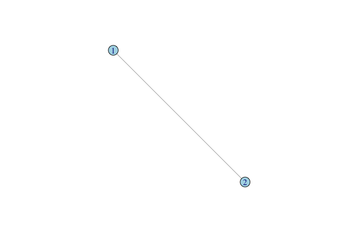

The call to the function `graph()` takes three arguments in this case. First, we enumerate the edges by listing the pairs of vertices which are connected. In this graph, there is only a single edge, so our first argument only contains one pair. Second, we define the size of our graph. This simple graph has only two vertices, so `n=2`. Third, the default graph type is directed, so to create an undirected graph, we need to specify `dir=FALSE`. The function `graph()` creates a graph object which, like any R object, is associated with a number of methods. When we plot a graph object, the plotting method used is `plot.igraph()`. There are a number of features (or perhaps peculiarities) of the defaults of `plot.igraph()`. First, is the vertex color. It's not hideous but it's not an obvious choice for a default color either. Second, the layout will not necessarily make sense to you as a human viewer of the graph and will typically change each time you call `plot.igraph()`. Fortunately, `igraph` has a number of excellent tools for assisting with graph layout.

A very handy utility for assiting with the layout of small graphs is `tkplot()`. Calling `tkplot()` will open an X11 window (the specifics of which might vary depending on your operating system). When your graph opens in this window, you will be able to move vertices around until you have a layout that you like. You then use the function `tk_coords(tkp.id)` (where `tkp.id` is the window number of your `tkplot`) to get the coordinates of your vertices. Showing how to use `tkplot()` in a document such as this is difficult, since it is an intrinsically interactive exercise. However, we can see how to layout a small graph once you have acquired the coordinates from `tk_coords()`.

``` r
# generate a triangle
g <- graph( c(1,2, 2,3, 1,3), n=3, dir=FALSE)
### do some stuff with tkplot() and get coords which we call tri.coords
tri.coords <- matrix( c(228,416, 436,0, 20,0), nr=3, nc=2, byrow=TRUE)
par(mfrow=c(1,2))
plot(g, vertex.color="lightblue")
plot(g, layout=tri.coords, vertex.color="lightblue")
```

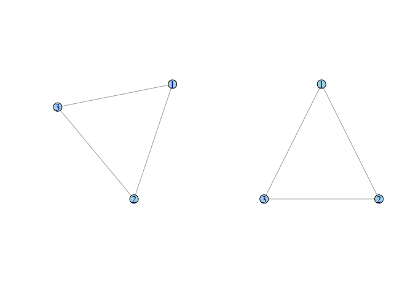

We can represent the relationships of our social network using a **matrix**. A matrix is simply a rectangular array of numbers with *n* rows and *k* columns. It is conventional to denote matrices mathematically using capital letters and boldface, such as **A**. We indicate the *i**j*th element (i.e., the element corresponding to row *i* and column *j*) of **A** as *a*<sub>*i**j*</sub>. A **sociomatrix** or **adjacency matrix** is a square matrix (i.e., *n* × *n*, where *n* is the number of vertices in the network). It is typically binary, with *a*<sub>*i**j*</sub> = 1 if individuals *i* and *j* share an edge and *a*<sub>*i**j*</sub> = 0 otherwise. The sociomatrix corresponding to our triangle is

\begin{equation}
\mathbf{A} = \left[ \begin{array}{cccc} 
 0   &  1   & 1 \\
 1   &  0   & 1 \\
 1   &  1   & 0  \end{array} \right]. 
\end{equation}
By convention, the diagonal elements of a sociomatrix are all zero (i.e., self-loops are not allowed). Sociomatrix **A** in the equation above is symmetric (*a*<sub>*i**j*</sub> = *a*<sub>*j**i*</sub>) because the graph is undirected. For a digraph, the upper triangle (i.e., matrix elements above the diagonal) of the sociomatrix will generally be different than the lower triangle.

``` r
A <- matrix( c(0,1,1, 1,0,1, 1,1,0), nrow=3, ncol=3, byrow=TRUE)
g <- graph_from_adjacency_matrix(A, mode="undirected", diag=FALSE)
plot(g, layout=tri.coords, vertex.color="lightblue")
```

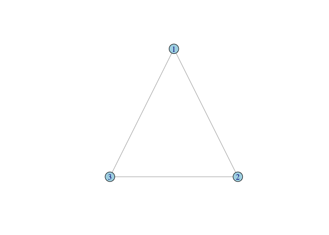

We can make a cyclical triangle too:

``` r
A1 <- matrix( c(0,1,0, 0,0,1, 1,0,0), nrow=3, ncol=3, byrow=TRUE)
g1 <- graph_from_adjacency_matrix(A1, mode="directed", diag=FALSE)
plot(g1, layout=tri.coords, vertex.color="lightblue")
```

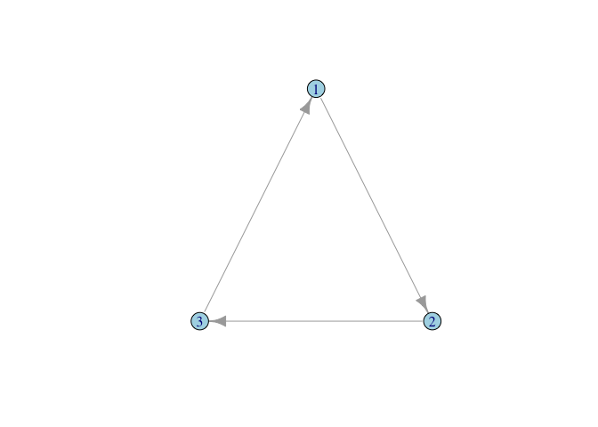

Note that we can keep recycling the same layout since we still have a triangle, even if its structure is different.

Most graphs are more complex than a single edge or triangle. This means that we need to be able to read data files into `igraph` (or whatever library we're using, such as `sna`). We can easily read a sociomatrix directly into R and then import it into `igraph`. A sociomatrix from Kapferer's classic (1972) study of social relations in a tailor shop in colonial North Rhodesia (now Zambia) describes the "instrumental" social interactions between 39 actors before organizing for an unsuccessful strike. We first read the matrix file into R while simultaneously converting it to a matrix (`R` will otherwise treat it as a data frame). We then import the sociomatrix into `igraph` and plot the results.

``` r
A <- as.matrix(read.table("http://web.stanford.edu/class/ess360/data/kapferer-tailorshop1.txt", 
                          header=TRUE, row.names=1))
G <- graph.adjacency(A, mode="undirected", diag=FALSE)
plot(G, vertex.color="lightblue")
```

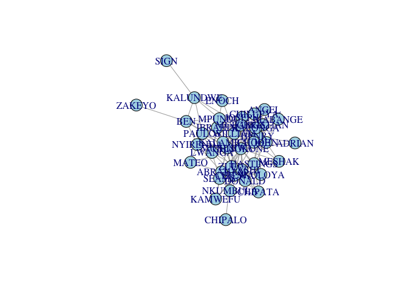

Note that the matrix contains row/column names (i.e., the pseudonyms for the 39 actors). These names are preserved as a vertex attribute in the `igraph` network object. When we plot, by default, these names are printed along with the vertices. Sometimes, when we have vertex names, it looks better to supress the vertices.

``` r
plot(G,vertex.size=0, vertex.color="white", vertex.frame.color="white", 
     vertex.label.cex=0.75, edge.color=grey(0.85))
```

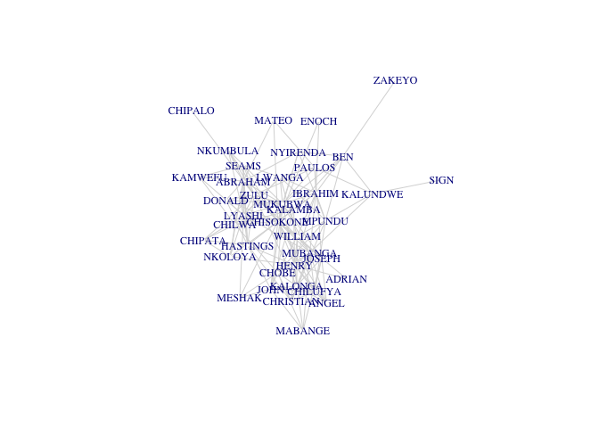

In addition to supressing the vertices, we've made the text size a bit smaller `vertex.label.cex=0.75` and made the edge color lighter to make the labels more readable, `edge.color=grey(0.85)`.

\section{Subgraphs, Walks, Paths, Reachability, Connectedness}
Now that we have a non-trivial graph, we can talk some more about graph properties. A **subgraph** is a graph 𝒢<sup>′</sup> where all the vertices and edges are also in graph 𝒢. Subgraphs can be generated by selecting either vertices or the edges from 𝒢. We commonly want to filter subgraphs that we think correspond to some sociological grouping. A very active area of research in the analysis of social networks is the field of community detection. We will talk about community detection in a different set of notes. For now, just think of it as a way of defining a set of vertices for a subgraph of `G`.

``` r
fg <- fastgreedy.community(G)
subg1 <- induced.subgraph(G, which(membership(fg)==4))
summary(subg1)
```

    ## IGRAPH a095495 UN-- 12 33 -- 
    ## + attr: name (v/c)

``` r
plot(subg1,vertex.size=0, vertex.color="white", vertex.frame.color="white", 
     vertex.label.cex=0.75, edge.color=grey(0.85))
```

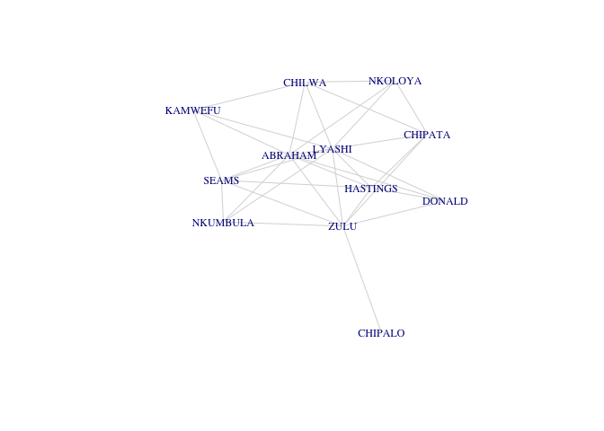

The subgraph `subg1` is **connected**, which means that there is a **path** between all the vertices of `subg1`. A path is a **walk** with no repeated vertex, where a walk is simply an alternating sequence of vertices and edges. When there is a path between two vertices *v*<sub>1</sub> and *v*<sub>2</sub>, we say that *v*<sub>1</sub> is **reachable** from *v*<sub>2</sub> and vice-versa. This means that all vertices within a connected subgraph are reachable from all others.

Suppose we combine two of the detected communities (call that `subg2`) and then remove a few edges from this new subgraph.

``` r
subg2 <- induced.subgraph(G, which(membership(fg)==4 | membership(fg)==1))
subg3 <- delete.edges(subg2, c(12, 39, 40))
par(mfrow=c(1,2))
plot(subg2, vertex.size=0, vertex.color="white", vertex.frame.color="white", 
     vertex.label.cex=0.5, edge.color=grey(0.85))
plot(subg3, vertex.size=0, vertex.color="white", vertex.frame.color="white", 
     vertex.label.cex=0.5, edge.color=grey(0.85))
```

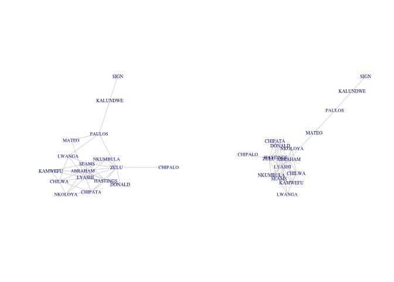

By removing three edges (Mateo-Abraham, Paulos-Nkumbula, Paulos-Lwanga) in our subgraph, we create two distinct **components**. A component is a maximally connected subgraph of a graph. In graph theory the property of **maximality** means that a subgraph 𝒢<sup>′</sup> is **maximal** for some property when the property holds for the subgraph but does not hold when additional vertices and incident edges are added. If we were to include a vertex from one of our two subgraphs of `subg3` in the other, the subgraph would no longer be a subcomponent (since that vertex would have no incident edges to the subgraph so there would be no path between it and the other vertices in the subgraph). One cannot traverse a path from, say, Kalundwe to Nkumbula.

While the subgraph containing Sign, Kalundwe, Paulos, and Matteo, (call it *G*<sub>2</sub><sup>′</sup>) is maximally connected, this doesn't mean that all members of *G*<sub>2</sub><sup>′</sup> are directly connected to each other -- it only means that there is a path between each of its members. If every vertex in a subgraph is connected to every other vertex in that subgraph, the subgraph is known as a **clique**. A graph in which every vertex is adjacent to every other vertex is also known as a **complete graph**. What makes a clique a clique is that it is a complete graph that is a subgraph of some larger graph. Cliques or near-cliques play an important role in network clustering and community detection.

We can generate and plot a complete or "full" graph of rank five:

``` r
plot(graph.full(5), vertex.color="lightblue")
```

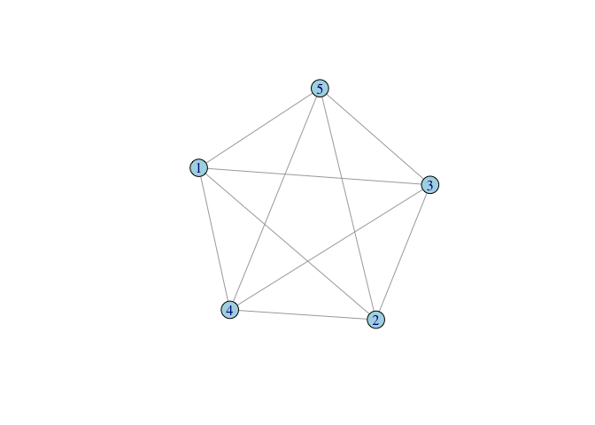

Complete graphs become particularly important when we discuss the estimation of regression models for social networks.

Degree and Degree Distributions
-------------------------------

The *degree* of a vertex, which we can denote *k*, is simply the number of edges incident to that vertex. For example, in the following figure, the degree of the light blue vertex is four.

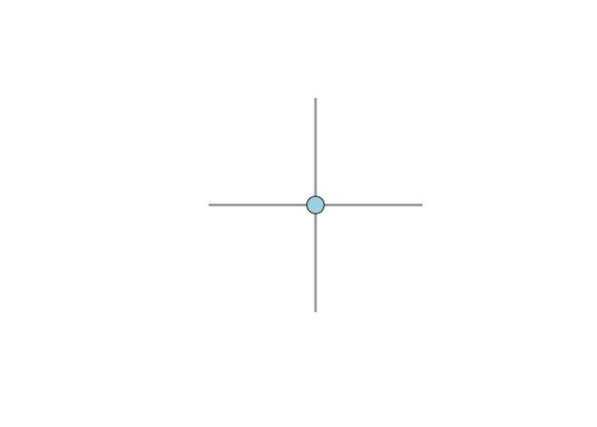

Degree is always calculated with respect to a single relation so that if you have a multiplex network (e.g., economic exchange and voluntary association co-membership), each vertex will have multiple degrees. If the graph is directed, then we define *in-degree* as the number of incoming directed edges incident to a vertex and the *out-degree* as the number of outgoing directed edges incident to a vertex.

The *degree distribution* of a graph is the aggregate of the individal degrees of the vertices of a graph. Degree distributions are very important for a number of features of interest in networks.

``` r
degree(G)
```

    ##   KAMWEFU  NKUMBULA   ABRAHAM     SEAMS   CHIPATA    DONALD   NKOLOYA 
    ##         4         5        13         9         5         6         6 
    ##     MATEO    CHILWA   CHIPALO    LYASHI      ZULU  HASTINGS    LWANGA 
    ##         3         9         1        15        14        10         8 
    ##  NYIRENDA CHISOKONE     ENOCH    PAULOS   MUKUBWA      SIGN   KALAMBA 
    ##         5        24         2         7        17         1         8 
    ##    ZAKEYO       BEN   IBRAHIM    MESHAK    ADRIAN  KALUNDWE    MPUNDU 
    ##         1         7        11         4         2         5         9 
    ##      JOHN    JOSEPH   WILLIAM     HENRY     CHOBE   MUBANGA CHRISTIAN 
    ##         9        10        10        14        10        14         8 
    ##   KALONGA     ANGEL  CHILUFYA   MABANGE 
    ##        10         6         9         5

Many networks reveal a highly-skewed degree distribution. Such skewed degree distributions can connect otherwise sparse networks and have been implicated, for example, in the persistence of infectious diseases in networks where the average behavior would otherwise lead to the extinction of the infection (May and Lloyd 2001). While many networks are indeed quite skewed, both the extent and the ubiquity of this phenomenon have been rather over-stated in the general networks literature (Jones and Handcock 2003b, Jones and Handcock (2003a)) and many human social networks (especially face-to-face relationships that are not technologically mediated) are not remarkably skewed at all (Salathé et al. 2010).

It is conventional in much of the networks literature to plot degree distributions as the complement of the cumulative distribution function (a.k.a., the survivor function) on semi-logarithmic axes. This convention arose because a linear plot is suggestive of a power-law degree distribution and there has been substantial interest in power-laws in network phenomena. A much more robust plot is simply as a histogram, which will better reveal the probability mass function of the degree distribution. Note that using semi-logarithmic axes precludes the inclusion of degree *k* = 0, since the logarithm of zero is undefined. Vertices of degree zero, known as *isolates* are often very important in and of themselves and can be diagnostic of social process, so a plot that precludes their inclusion is highly problematic.

``` r
g <- erdos.renyi.game(1000, 1/500)
dd <- degree_distribution(g)
lendd <- length(dd)
plot((1:lendd)-1,dd, type="h", lwd=20, lend=2, col="blue", xlab="Degree (k)", ylab="Probability(K=k)")
```

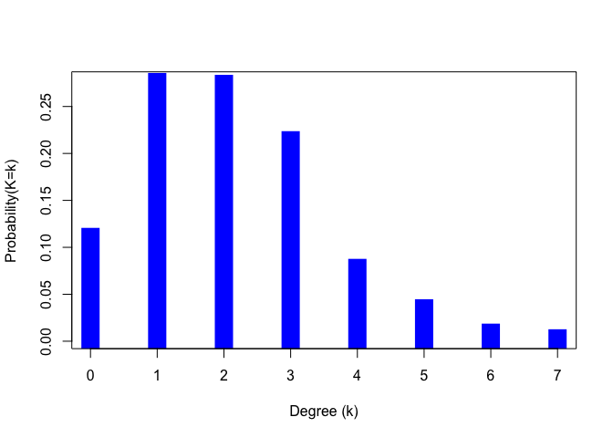

Geodesics
---------

A **geodesic** is the shortest path between two vertices. Geodesics are important for centrality and network flow discussed in a later set of notes. The largest geodesic of a graph is known as the **diameter** of the graph. We can find the diameter for the Kapferer tailor shop network. There are only 39 actors in this network, and it is pretty densly connected, so the diameter is not huge (*d* = 4). In fact, there are 54 geodesics of length four.

``` r
d <- get.diameter(G)
E(G)$color <- "SkyBlue2"
E(G)$width <- 1
E(G, path=d)$color <- "red"
E(G, path=d)$width <- 2
V(G)$labelcolor <- V(G)$color  <- "blue"
V(G)[d]$labelcolor <- V(G)[d]$color <- "red"
plot(G, vertex.color="white", vertex.frame.color="white", vertex.label.cex=0.5,
     edge.color=E(G)$color, edge.width=E(G)$width,
     vertex.label.color=V(G)$labelcolor,
     vertex.size=3)
```

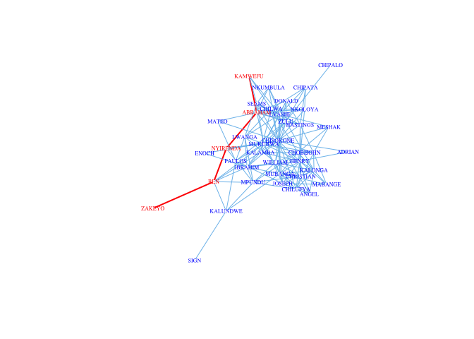

<!--## Subgraphs, Components, Clusters


A **component** is a maximally connected subgraph -- that is, there are paths that connect all the vertices comprising a component. -->
Edgelists and Other Graph Formats
---------------------------------

There are many, many formats for relational data. Probably the most universal and simplest is known as a **edgelist**. An edgelist is simply a two-column matrix in which each row represents a (possibly directed) edge between the vertex listed in first column and the second column. Note that this is essentially what we passed to the `graph()` function above.

Dyads, Triads, and Other Local Structures
=========================================

We are often interested in evaluating how an observed social network differs from some theoretical network. To do this, it is useful to count various structures and compare the counts to known null models. Understanding these counts will eventually serve an important role in developing regression-like models for network inference. An important concept for dealing with triads (and other basic network structures) is **isomorphism**. Two graphs are said to be isomorphic if we cannot tell the difference between them when the vertex labels are removed. This is similar to the concept, which is critical in Bayesian statistics, of exchangeability.

Dyad Census
-----------

A **dyad** is simply an unordered pair of vertices in a graph. As we have discussed previously, there are ${n \\choose 2} = n(n-1)/2$ dyads in a graph of size *n*.

In a directed graph, there are four different types of relations between vertices *i* and *j*: *i* → *j*, *i* ← *j*, *i* ↔ *j* and *i*  *j*.

``` r
g <- graph( c( 1,2, 3,4, 5,6, 6,5), n=8)
ccc <- cbind(c(300, 100, 100, 300, 100, 300, 100, 300),  
             c(300, 300, 230, 230, 160, 160, 90, 90))
plot(g, layout=ccc, vertex.color=grey(0.75))
```

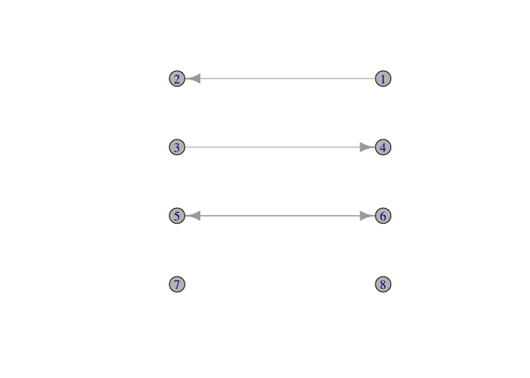

Note that *i* → *j*, *i* ← *j* are isomorphic.

Triad Census
------------

There is a conventional nomenclature for triads, following the pathbreaking paper by Davis and Leinhardt (1972). There are sixteen distinct triads:

| Triad | Edges                      |
|-------|----------------------------|
| 003   | *A*, *B*, *C*              |
| 012   | *A* → *B*, *C*             |
| 102   | *A* ↔ *B*, *C*             |
| 021D  | *A* ← *B* → *C*            |
| 021U  | *A* → *B* ← *C*            |
| 021C  | *A* → *B* → *C*            |
| 111D  | *A* ↔ *B* ← *C*            |
| 111U  | *A* ↔ *B* → *C*            |
| 030T  | *A* → *B* ← *C*, *A* → *C* |
| 030C  | *A* ← *B* ← *C*, *A* → *C* |
| 201   | *A* ↔ *B* ↔ *C*            |
| 120D  | *A* ← *B* → *C*, *A* ↔ *C* |
| 120U  | *A* → *B* ← *C*, *A* ↔ *C* |
| 120C  | *A* → *B* → *C*, *A* ↔ *C* |
| 210   | *A* → *B* ↔ *C*, *A* ↔ *C* |
| 300   | *A* ↔ *B* ↔ *C*, *A* ↔ *C* |

The table provides notation for the sixteen triads. The first number is the number of mutual dyads, the second is the number of asymmetric dyads, and the third is the number of null dyads in the triad. The letters stand for Up, Down, Cyclical, and Transitive. For example, 030T has zero mutual, three asymmetric, and zero null dyads and is transitive, whereas 030C has zero mutual, three asymmetric, and zero null dyads and is cyclical.

<center>

</center>
<!--The default layout will not line up the triad graphs out the way most people would want. Playing around with `tkplot()`, we can find a layout that is aesthetically pleasing.


```r
g030t <- graph( c(1,2, 2,3, 1,3), n=3)
plot(g030t, vertex.color="lightblue")
```


```r
#tkplot(g030t)
#tk_coords(1)
tri.coords <- matrix( c(228,416, 436,0, 20,0), nr=3, nc=2, byrow=TRUE)
plot(g030t, layout=tri.coords, vertex.color="lightblue")
```

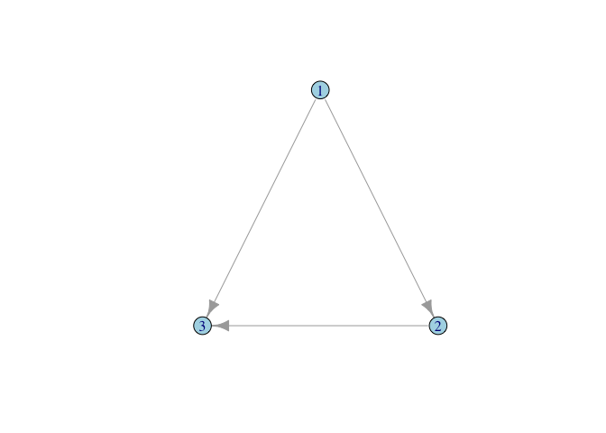
-->
We can use the `igraph` command `triad_census()` to perform a triad census. The output is the count of the number of triads using the Davis and Leinhardt (1972) categorization, in the order of the table above.

``` r
g <- sample_gnm(15, 45, directed = TRUE)
plot(g, vertex.color="lightblue")
```

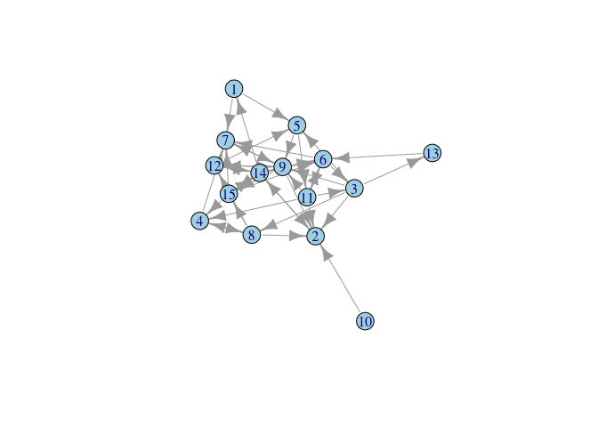

``` r
triad_census(g)
```

    ##  [1] 125 161  38  18  17  26  23  19  10   3   8   0   1   5   1   0

Transitive Triads and Dominance
-------------------------------

Transitivity implies dominance whereas cyclicity implies exchange. A linear hierarchy means that all triads must be transitive (030T) (Chase 1974).

``` r
## define triads
DD <- graph( c(3,1, 3,2), n=3, directed=TRUE)
DS <- graph( c(3,1, 2,1), n=3, directed=TRUE)
BDID <- graph( c(3,1, 2,3), n=3, directed=TRUE)
ISDB <- graph( c(3,1, 1,2), n=3, directed=TRUE)
labs <- c("B","C","A")
```

Linear dominance hierarchies are common in animal behavior. A linear dominance hierarchy implies that all triples in the network are of the 030T form. What gives rise to this? Chase (1974) noted that there are two standard explanations for linear dominance hierarchies: (1) the "tournament model" and (2) the "correlation model." In the tournament model, individual dyads within a group pair off to establish dominance based on intrinsic qualities such as strength, aggressiveness or the size of weapons (e.g., canines, antlers). The overall dominance hierarchy is formed after an exhaustive "round-robin tournament" establishes all pairwise dominance interactions. In contrast, the correlation model proposes that a correlation exists between traits that predict dominance and the actual dominance interactions of the animals (e.g., antler size in red deer). Dominance hierarchies arise by animals sorting themselves along the dimension of this trait (which may be a composite).

Chase notes that these models, while intuitively appealing, are implausible. To yield a linear dominance hierarchy, the probabilities of victory in pairwise interactions or the strength of the correlation between the trait and actual dominance would have to be unrealistically high. Chase (1974: 378) writes that "extreme probability distributions are required to predict a strong hierarchy from a tournament no matter what the species of animal, the method of pairwise competition, or the individual traits that are conceived to determine probability of dominance."

Chase concludes by noting that both the tournament and the correlation models share the quality that they are attempts to explain a social phenomenon using data gathered outside the hierarchy formation process itself. In a follow-up paper, Chase (1982) proposed a simple mechanism by which a network dominated by 030T triads can arise from simple social interactions. Chase (1982) observes that there are only four possible sequences of the first two of dominance interactions in a triad. Let *A* be the individual who becomes dominant in the first interaction, *B* is the subordinate, and *C* is a bystander. Following this first interaction, there are four possible sequences of events: (1) Double Dominance (DD), where *A* dominates the bystander *C* in addition to the first target *B*, (2) Double Subordinance (DS), where the bystander *C* dominates the subordinate *B* (3) Bystander Dominates Initial Dominant (BDID), where the bystander *C* dominates *A*, and (4) Initial Subordinate Dominates Bystander (ISDB), where the initial subordinate *B* dominates the bystander.

Of these four possible sequences, two yield 030T triads regardless of the third interaction in the sequence. These are DD and DS. The other two, BDID and ISDB, can lead to a transitive triad, but don't necessarily. This is illustrated in the following figure. For DD, a transitive triangle results whether B dominates C or vice-versa. Similarly, a transitive triangle results whether in the DS case regardless of whether A dominates C or C dominates A. In the case of both BDID and ISDB, there is a 50% chance that the triangle will wind up transitive and a 50% chance it will be cyclical. In total then, six of the eight possibilities in this triadic dominance interaction yield transitive (030T) triangles.

``` r
par(mfrow=c(2,2))
plot(DD, layout=tri.coords,
     vertex.label=labs,
     vertex.label.family="sans",
     vertex.label.color="black",
     vertex.color="lightblue",
     vertex.frame.color="black",
     vertex.size=50,
     edge.width=2,
     edge.color=grey(0.5))
title("DD")

plot(DS, layout=tri.coords,
     vertex.label=labs,
     vertex.label.family="sans",
     vertex.label.color="black",
     vertex.color="lightblue",
     vertex.frame.color="black",
     vertex.size=50,
     edge.width=2,
     edge.color=grey(0.5))
title("DS")

plot(BDID, layout=tri.coords,
     vertex.label=labs,
     vertex.label.family="sans",
     vertex.label.color="black",
     vertex.color="lightblue",
     vertex.frame.color="black",
     vertex.size=50,
     edge.width=2,
     edge.color=grey(0.5))
title("BDID")

plot(ISDB, layout=tri.coords,
     vertex.label=labs,
     vertex.label.family="sans",
     vertex.label.color="black",
     vertex.color="lightblue",
     vertex.frame.color="black",
     vertex.size=50,
     edge.width=2,
     edge.color=grey(0.5))
title("ISDB")
```

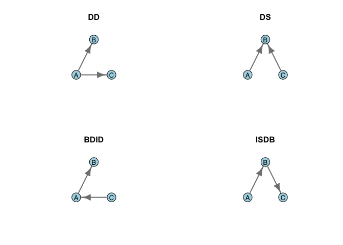

Consequently, transitivity seems to be a sort of default for triadic interactions. This is an interesting observation because it suggests that when there is an excess of 030C triads, some sort of energy has been added to the system. Using data from an experimental hierarchy of chickens, Chase (1982) shows that the majority of triads (17/23) form with the DD sequence, followed by the DS (4/23). The remaining two triads formed by BDID and ISDB (one each). Chase (1982: 229) suggested that "Winning begets winning": winners go on to dominate bystanders rather than the other way around. Relationship to testosterone winner effects??

Are Triads Important?
---------------------

Since the early work of Simmel, triads have played a central role in structural theories of human action (e.g., Evans-Pritchard (1929) and eventually Heider (1958) on structural balance, Granovetter (1973) on weak ties, Chase (1982) on triads and hierarchies as discussed above, Coleman (1988) on network closure, Burt (1992) on structural holes). However, Faust (2007, <-@faust2008>, <-@faust2010>) has shown that &gt;90% of the variance in triad distributions can be accounted for by lower-level features of networks such as edge density and the dyad census. Furthermore, triads have been shown to be highly problematic in regression models for social networks. Inclusion of triangle terms in exponential random graph models makes model degeneracy likely. Handcock (2003) has shown that the constraints on triangles imposed by edge density can be quite severe, making the MCMC-based estimation of ergms very difficult.

Faust (2010) shows that triads are still important. Shared edgewise partnerships save triads in ergms.

Signed Graphs and Structural Balance
------------------------------------

In 1929, pioneering British social anthropologist E.E. Evans-Pritchard, known as "EP" to his contemporaries and students, wrote a short paper for *Man*, the journal of the Royal Anthropological Institute (Evans-Pritchard 1929). He noted a paradox: Sons among the Azande of present-day South Sudan treated their mothers with cool detachment and frequent contempt, depsite the fact that Azande mothers would dote on their sons. Why was this? EP's reasoning is an early example of relational thinking. EP argued that the tense relationship bet: "Therefore to grasp the full meaning of the -mother relationship we have to take into account not only the whole complex of mutual obligations and privileges standardized modes of behavior, biological and legal affinities and terms of nomenclature composing this relationship, but we have equally to study those which compose the husband-wife and father-son relationships." The son grows up seeing his father treat his mother with diffidence and contempt and because the favor of the father is all-important for the Zande boy, he aligns his affect with that of his father.

We can represent this triadic relationship using a signed graph, in which the edges of the graph contain weights of +1 if the relationship is positive and −1 if they are negative. Calculating the product of the cycles provides a way of assessing the stability of the structure. If the overall sign of the triad is negative, then its relations are out-of-balance. If they are positive, on the other hand, they are balanced and we expect a more harmonious, stable structure. We can represent the edge weights by coloring the edges green for positive and red for negative. The two stable configurations for a signed triad are either all positive or, as suggested by EP for Zande father-mother-son triads, two negative and one positive.

``` r
eplabs <- c("M","S","F")
EP <- graph( c(1,2, 1,3, 2,3), n=3, directed=FALSE)
plot(EP, layout=tri.coords,
     vertex.label=eplabs,
     vertex.label.family="sans",
     vertex.label.color="black",
     vertex.color="white",
     vertex.frame.color="black",
     vertex.size=25,
     edge.width=5,
     edge.color=c("red","red","green"))
```

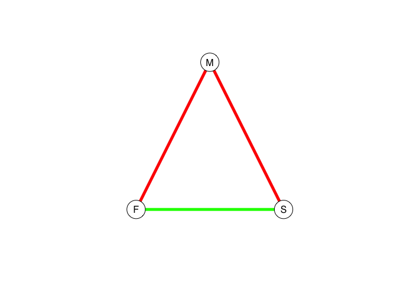

Evans-Pritchard's idea of the importance of positive cycles was more fully elaborated in Heider's theory of structural balance. Moody and White biconnectivity, etc.

<!--# Centrality

When we first read a graph into `R`, it is generally a good idea to explore it a bit to get a sense of its overall properties. The best place to start is with the graph summary. We can use Padgett's data on Florentine marriages to explore the analysis of graphs using igraph.


```r
require(igraph)
flo <- read.table("http://web.stanford.edu/class/ess360/data/flo.txt", 
                  header=TRUE, row.names=1)
gflo <- graph_from_adjacency_matrix(as.matrix(flo), mode="undirected")
gflo
```

```
## IGRAPH c5e8988 UN-- 16 20 -- 
## + attr: name (v/c)
## + edges from c5e8988 (vertex names):
##  [1] Acciaiuoli--Medici       Albizzi   --Ginori      
##  [3] Albizzi   --Guadagni     Albizzi   --Medici      
##  [5] Barbadori --Castellani   Barbadori --Medici      
##  [7] Bischeri  --Guadagni     Bischeri  --Peruzzi     
##  [9] Bischeri  --Strozzi      Castellani--Peruzzi     
## [11] Castellani--Strozzi      Guadagni  --Lamberteschi
## [13] Guadagni  --Tornabuoni   Medici    --Ridolfi     
## [15] Medici    --Salviati     Medici    --Tornabuoni  
## + ... omitted several edges
```

```r
plot(gflo, vertex.color="lightblue")
```

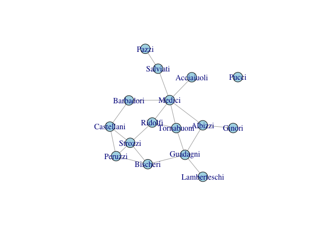

The summary of our graph provides a great deal of information, even if it is a bit terse. The first piece of information is that it is, in fact, an igraph object. Following `IGRAPH` indicator, we get a one-to-four letter code indicating what type of graph it is. For the Florentine marriage graph, it is of type `UN--`, which means that it is undirected (`U`) and named (`N`). If our graph was weighted, there would be a third letter `W` and if it were bipartite, the fourth letter would be `B`. As `gflo` is neither weighted nor bipartite, the code is only two letters, `UN`. Following this two-letter code, we get a summary of the number of vertices and edges in the graph, `16 20`. There are 16 vertices and 20 edges in `gflo`. Finally, we see that there is one attribute contained in the graph, `+ attr: name (v/c)`. This means that there is a vertex attribute (`v`) called "name" which is of type character (`c`).

Given that there are a reasonably small number of vertices and (especially) edges, another good idea to to visualize the graph. In general, it is always a good idea to do this. However, if the graph is really big and has lots of edges, the visualization may take some time so you shouldn't do it casually. For the Florentine marriages, we have only 16 vertices and 20 edges, so plotting is simple.

One of the first things that we discover when we visualize the Florentine marriage network is that one family, Pucci, is an isolate. There were no marriage ties between the Puccis and any of the other 15 families in Padgett's sample. 

Because the graph is so small, it's easy to see that Pucci is an isolate. In other cases, it may not be so obvious. There are a number of things we can do to study the overall connectedness of a graph. The first is to ask whether the graph is, in fact, connected. For a graph $\mathcal{G}$ to be connected, there must be a path between all vertices in $\mathcal{G}$. If the graph is not connected, we might want to know how many distinct components there are. A component is a maximally connected subgraph of a graph (i.e., a path exists between all vertices in the subgraph). We can find the components of our graph using the somewhat unfortunately named igraph function `clusters()`. The name is unfortunate because "cluster" has many meanings in both network analysis and beyond, but we work with the function names available to us. 


```r
is.connected(gflo)
```

```
## [1] FALSE
```

```r
clusters(gflo)
```

```
## $membership
##   Acciaiuoli      Albizzi    Barbadori     Bischeri   Castellani 
##            1            1            1            1            1 
##       Ginori     Guadagni Lamberteschi       Medici        Pazzi 
##            1            1            1            1            1 
##      Peruzzi        Pucci      Ridolfi     Salviati      Strozzi 
##            1            2            1            1            1 
##   Tornabuoni 
##            1 
## 
## $csize
## [1] 15  1
## 
## $no
## [1] 2
```

We can see that `gflo` is not connected (since we know from visual inspection that Pucci is an isolate). There are two components in `gflo`: the main component that includes 15 of the 16 families and then a component of one (Pucci), also known as an isolate.

Knowing that the graph is not connected, we can use the command `decompose.graph()` to extract the elements. In this case, we really only care about the first component, since the second of the two components is simply an isolate.


```r
gflo1 <- decompose.graph(gflo)[[1]]
plot(gflo1, vertex.color="lightblue")
```

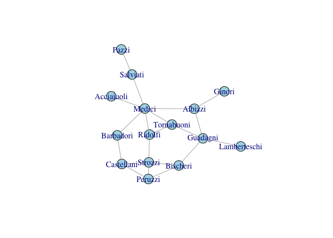
-->
Density
=======

The number of unordered pairs of vertices in a graph of size *n* is *n*(*n* − 1)/2. This means that the **density** of edges in a graph is simply given by the ratio of the number of observed edges to the number of possible edges, 2*e*/*n*(*n* − 1), where *e* is the number of edges in the graph.

We can use Padgett's data on Florentine marriages to explore some of the properties with more complex networks.

``` r
require(igraph)
flo <- read.table("http://web.stanford.edu/class/ess360/data/flo.txt", 
                  header=TRUE, row.names=1)
gflo <- graph_from_adjacency_matrix(as.matrix(flo), mode="undirected")
gflo
```

    ## IGRAPH 264e3f0 UN-- 16 20 -- 
    ## + attr: name (v/c)
    ## + edges from 264e3f0 (vertex names):
    ##  [1] Acciaiuoli--Medici       Albizzi   --Ginori      
    ##  [3] Albizzi   --Guadagni     Albizzi   --Medici      
    ##  [5] Barbadori --Castellani   Barbadori --Medici      
    ##  [7] Bischeri  --Guadagni     Bischeri  --Peruzzi     
    ##  [9] Bischeri  --Strozzi      Castellani--Peruzzi     
    ## [11] Castellani--Strozzi      Guadagni  --Lamberteschi
    ## [13] Guadagni  --Tornabuoni   Medici    --Ridolfi     
    ## [15] Medici    --Salviati     Medici    --Tornabuoni  
    ## + ... omitted several edges

``` r
plot(gflo, vertex.color="lightblue")
```

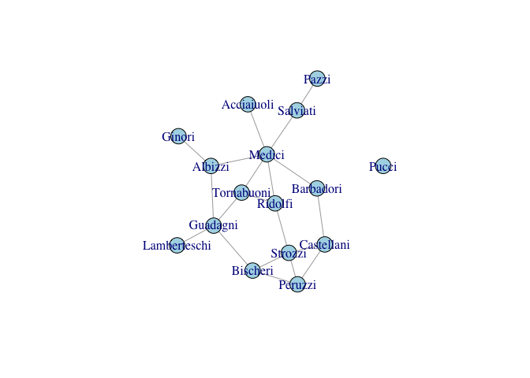

Now let's manually calculate the density of this network:

``` r
## note we're working with the matrix, not the graph object here
n <- dim(flo)[1]
2*sum(apply(flo,1,sum)/2)/(n*(n-1))
```

    ## [1] 0.1666667

Here, we summed along the rows of the matrix and then summed the resulting vector to get the number of elements in the sociomatrix. We then divided by two since each marriage is represented twice in the sociomatrix (since it is an undirected relation). Taking out the Pucci isolate, we get a slightly different density. We can use the igraph function `graph.density()` to reassure ourselves that this is, in fact, the right value.

``` r
n <- n-1
2*sum(apply(flo,1,sum)/2)/(n*(n-1))
```

    ## [1] 0.1904762

``` r
graph.density(gflo1)
```

    ## [1] 0.1904762

Centrality
==========

In his classic essay, [Lin Freeman](http://moreno.ss.uci.edu/) (1978) lays out the different notions of centrality:

-   **degree centrality** captures the idea that individuals with many contacts are central to a structure. This measure is calculated simply as the degree of the individual actor.

-   **closeness centrality** captures the idea that a central actor will be close to many other actors in the network. Closeness is measured by the geodesics between actor *i* and all others.

-   **betweenness centrality** captures the idea that high-centrality individuals should be on the shortest paths between other pairs of actors in a network. The betweenness of actor *i* is simply the fraction of all geodesics in the graph on which *i* falls.

Degree Centrality
-----------------

For non-directed graphs, the degree centrality of vertex *i* is simply the sum of edges incident to *v*<sub>*i*</sub>:

*C*<sub>*D*</sub>(*v*<sub>*i*</sub>)=*d*(*v*<sub>*i*</sub>)=∑<sub>*j*</sub>*x*<sub>*i**j*</sub> = ∑<sub>*j*</sub>*x*<sub>*j**i*</sub>.

Note that while we call this a "centrality" measure, it is simply the degree of node *i*. <!--This observation gets the fundamental confounding of degree-based and other centrality-based measures of social structure discussed in Salath\'{e} and Jones (2010).--> Sometimes degree centrality measure will be standardized by the size of the graph *n*: *C*′<sub>*D*</sub>(*v*<sub>*i*</sub>)=*d*(*v*<sub>*i*</sub>)/(*n* − 1), where we subtract one from the size of the graph to account for the actor itself.

Closeness
---------

For non-directed graphs, the closeness centrality of vertex *i* is the inverse of the sum of geodesics between *v*<sub>*i*</sub> and *v*<sub>*j*</sub>,   *j* ≠ *i*:

$$ C\_C(v\_i) = \\left\[ \\sum\_{j=1}^n d(v\_i,v\_j)\\right\]^{-1}, $$

where *d*(*v*<sub>*i*</sub>, *v*<sub>*j*</sub>) is the distance (measured as the minimum distance or geodesic) between vertices *i* and *j*. Note that if any *j* is not reachable from *i*, *C*<sub>*C*</sub>(*v*<sub>*i*</sub>)=0 since the distance between *i* and *j* is infinite! This means that we often want to restrict our measurements of centrality to connected components of a graph. To standardize, we multiply by *n* − 1, the number of vertices not including *i*: *C*′<sub>*C*</sub>(*v*<sub>*i*</sub>)=(*n* − 1)*C*<sub>*C*</sub>(*v*<sub>*i*</sub>).

Betweenness
-----------

For non-directed graphs, the betweenness centrality of vertex *i* is the fraction of all geodesics in the graph on which *i* lies:

*C*<sub>*B*</sub>(*v*<sub>*i*</sub>)=∑<sub>*j* &lt; *k*</sub>*g*<sub>*j**k*</sub>(*v*<sub>*i*</sub>)/*g*<sub>*j**k*</sub>,

where *g*<sub>*j**k*</sub> is the number of geodesics linking actors *j* and *k* and *g*<sub>*j**k*</sub>(*v*<sub>*i*</sub>) is the number of geodesics linking actors *j* and *k* that contain actor *i*. It can be standardized by dividing by the number of pairs of actors not including *i*, (*n* − 1)(*n* − 2)/2: *C*′<sub>*B*</sub>(*v*<sub>*i*</sub>)=*C*<sub>*B*</sub>(*v*<sub>*i*</sub>)/\[(*n* − 1)(*n* − 2)/2\].

Other measures of centrality
----------------------------

### Informational centrality

Another notion of centrality is that a central person is someone who knows people who know a lot of people. This idea can be captured using a measure known as **information centrality**. The calculation of information centrality is a bit more complicated than for the other three measures and requires some linear algebra. Start with the sociomatrix **X**. From this, we calculate an intermediate matrix **A**. For a binary relation, *a*<sub>*i**j*</sub> = 0 if *x*<sub>*i**j*</sub> = 1 and *a*<sub>*i**j*</sub> = 1 if *x*<sub>*i**j*</sub> = 0 for *i* ≠ *j* (that is, the non-diagonal elements of **A** are the complements of their values in **X**). The diagonal elements of **A** (*a*<sub>*i**i*</sub>) are simply the degree of vertex *i* plus one, *a*<sub>*i**i*</sub> = *d*(*v*<sub>*i*</sub>)+1. Once we have **A**, we invert it yielding a new matrix **C****A**<sup>−1</sup>. We then calculate *T*, the trace of **C**, which is simply the sum of its diagonal elements and *R* which is one of the row sums of **C** (they are all the same). Information centrality is then simply

$$ C\_I(v\_i) = \\frac{1}{d(v\_i) + (T - 2R)/n)}, $$

where, as usual, *d*(*v*<sub>*i*</sub>) is the degree of vertex *i* and *n* is the size of the graph.

There is no implementation of information centrality in `igraph`. This can be calculated either in `sna` or using the following function, which takes a sociomatrix as its only argument. It assumes that the matrix is binary.

``` r
infocentral <- function(X){
  ## assumes binary relation
  k <- dim(X)[1]
  A <- matrix(as.numeric(!X),nr=k,nc=k)
  diag(A) <- apply(X,1,sum)+1
  C <- solve(A)
  T <- sum(diag(C))
  R <- apply(C,1,sum)[1]
  ic <- 1/(diag(C) + (T - 2*R)/k)
  return(ic)
}
```

### Eigenvalue Centrality

Yet another approach to centrality was suggested by Bonacich (1972). He suggests that the eigenvectors of the sociomatrix are a fruitful way of thinking about centrality. As with information centrality, the eigenvector approach captures the idea that central people will have well-connected alters but that the relative importance of these alters falls off with distance from ego. While the eigenvector (preferably the dominant one) of the sociomatrix is an excellent measure of centrality, the metric Bonacich (1987) suggests is actually a bit more complex:

*C*(*α*, *β*)=*α*(**I** − *β***X**)<sup>−1</sup>**X****1**,

where *α* is a parameter, *β* measures the extent to which an actor's status is a function of the statuses of its alters decay of influence from the focal actor, **I** is an identity matrix of the same rank as the sociomatrix **X**, and **1** is a column vector of ones.

The size of *β* determines the degree to which Bonacich centrality is a measure of local or global centrality. When *β* = 0, only an actor's direct ties are taken into account -- Bonacich centrality becomes proportional to degree centrality. However, when *β* &gt; 0, an actor's alters' ties are also taken into account. The larger the value of *β*, the more distant ties will matter. It is also possible for *β* to be less than zero. In this case, being connected to powerful alters who themselves have many alters negatively affects an actor's status. This seemingly odd situation captures the effect observed in bargaining experiments performed on networks by Cook et al. (1983), where an individual's ability to negotiate a favorable outcome is lessened when he or she must bargain with powerful, well-connected alters.

Comparing Centralities
----------------------

Consider the centrality measures on Padgett's Florentine marriage data. For these analyses, we will take out the Pucci family since they are an isolate. For the standard centrality measures discussed by Freeman, Pucci will have a score of zero. Information and eigenvalue centrality only work on connected graphs.

``` r
gflo1 <- induced.subgraph(gflo, subcomponent(gflo,1))
## remove Pucci from the matrix
flo1 <- flo[-12,-12]
ic <- infocentral(flo1)
CE <- abs(bonpow(gflo1))

measures <- cbind(CD=degree(gflo1),
              CB=round(betweenness(gflo1),1),
              CC=round(closeness(gflo1),2),
              CI=round(ic,2),
              CE=round(CE,2))
dimnames(measures)[[1]] <- dimnames(flo1)[[1]]
measures
```

    ##              CD   CB   CC   CI   CE
    ## Acciaiuoli    1  0.0 0.03 0.55 0.37
    ## Albizzi       3 19.3 0.03 0.83 2.02
    ## Barbadori     2  8.5 0.03 0.76 1.47
    ## Bischeri      3  9.5 0.03 0.83 0.00
    ## Castellani    3  5.0 0.03 0.79 1.29
    ## Ginori        1  0.0 0.02 0.48 1.84
    ## Guadagni      4 23.2 0.03 0.92 0.18
    ## Lamberteschi  1  0.0 0.02 0.51 0.00
    ## Medici        6 47.5 0.04 1.06 0.55
    ## Pazzi         1  0.0 0.02 0.39 0.00
    ## Peruzzi       3  2.0 0.03 0.78 0.55
    ## Ridolfi       3 10.3 0.04 0.90 1.29
    ## Salviati      2 13.0 0.03 0.60 0.18
    ## Strozzi       4  9.3 0.03 0.88 0.18
    ## Tornabuoni    3  8.3 0.03 0.90 1.10

``` r
# Plot the graph one last time with the vertices sized according to
# betweenness centrality
plot(gflo1, vertex.size=measures[,"CB"]+1, vertex.color="lightblue")
```

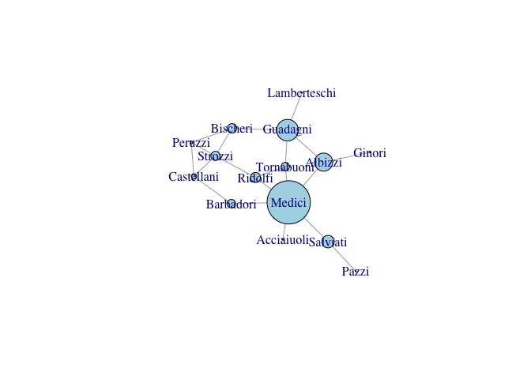

While centrality measures capture different notions of centrality, power, prestige, etc., they are generally fairly highly correlated. This said, some measures can be quite divergent. We can see this with eigenvalue centralities of the Florentine families. The Medici are clearly central to this marriage network. However, because they are so dominant, their alters do not have as many connections as they do. As a result, the Medici have a low eigenvalue centrality, but the Albizzi do quite well.

``` r
## correlation matrix of the centralities
cor(measures)
```

    ##             CD         CB        CC        CI          CE
    ## CD  1.00000000 0.84392220 0.7463380 0.9207909 -0.02813901
    ## CB  0.84392220 1.00000000 0.6592939 0.7143692  0.01003666
    ## CC  0.74633802 0.65929385 1.0000000 0.8238569  0.12584573
    ## CI  0.92079092 0.71436925 0.8238569 1.0000000  0.14762599
    ## CE -0.02813901 0.01003666 0.1258457 0.1476260  1.00000000

``` r
## vertex size proportional to eigenvalue centrality
plot(gflo1, vertex.size=measures[,"CE"]*10, vertex.color="lightblue")
```

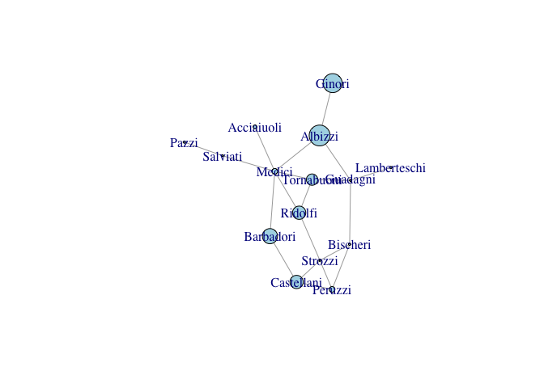

<!-- ### On the Uses of Centralities

Information and eigenvalue centralities will be more sensitive to the addition of peripheral actors than will the other measures, particularly betweenness... -->
References
==========

Bonacich, Phillip. 1972. “Factoring and Weighting Approaches to Status Scores and Clique Identification.” *The Journal of Mathematical Sociology* 2 (1): 113–20. doi:[10.1080/0022250X.1972.9989806](https://doi.org/10.1080/0022250X.1972.9989806).

———. 1987. “Power and Centrality: A Family of Measures.” *American Journal of Sociology* 92 (5): 1170–82. <http://www.jstor.org/stable/2780000>.

Burt, R. S. 1992. *Structural Holes: The Social Structure of Competition*. Cambridge: Harvard University Press.

Chase, Ivan D. 1974. “Models of Hierarchy Formation in Animal Societies.” *Behavioral Science* 19 (6): 374–82. doi:[10.1002/bs.3830190604](https://doi.org/10.1002/bs.3830190604).

———. 1982. “Dynamics of Hierarchy Formation: The Sequential Development of Dominance Relationships.” *Behaviour* 80 (3-4): 218–39. doi:[10.1163/156853982x00364](https://doi.org/10.1163/156853982x00364).

Coleman, James S. 1988. “Social Capital in the Creation of Human Capital.” *American Journal of Sociology* 94: S95–S120. <http://www.jstor.org/stable/2780243>.

Cook, Karen S., Richard M. Emerson, Mary R. Gillmore, and Toshio Yamagishi. 1983. “The Distribution of Power in Exchange Networks: Theory and Experimental Results.” *American Journal of Sociology* 89 (2): 275–305. doi:[10.1086/227866](https://doi.org/10.1086/227866).

Davis, J.A., and S. Leinhardt. 1972. “The Structure of Positive Interpersonal Relations in Small Groups.” In *Sociological Theories in Progress*, edited by J. Berger, 2:218–51. Boston: Houghton Mifflin.

Evans-Pritchard, E. E. 1929. “148. the Study of Kinship in Primitive Societies.” *Man* 29: 190–94. <http://www.jstor.org/pss/2789028>.

Faust, Katherine. 2007. “Very Local Structure in Social Networks.” *Sociological Methodology* 37: 209–56. doi:[10.1111/j.1467-9531.2007.00179.x](https://doi.org/10.1111/j.1467-9531.2007.00179.x).

———. 2010. “A Puzzle Concerning Triads in Social Networks: Graph Constraints and the Triad Census.” *Social Networks* 32 (3): 221–33. doi:[10.1016/j.socnet.2010.03.004](https://doi.org/10.1016/j.socnet.2010.03.004).

Freeman, Linton C. 1978. “Centrality in Social Networks Conceptual Clarification.” *Social Networks* 1 (3): 215–39. doi:[10.1016/0378-8733(78)90021-7](https://doi.org/10.1016/0378-8733(78)90021-7).

Granovetter, Mark S. 1973. “The Strength of Weak Ties.” *American Journal of Sociology* 78 (6): 1360–80. <http://www.jstor.org/stable/2776392>.

Handcock, M. S. 2003. “Assessing Degeneracy in Statistical Models of Social Networks.” CSSS Working Papers 39. Center for Statistics and the Social Sciences, University of Washington. <https://www.csss.washington.edu/research/working-papers/39>.

Heider, F. 1958. *The Psychology of Interpersonal Relations*. Hillsdale, NJ: Lawrence Erlbaum Associates.

Jones, J.H., and M. S. Handcock. 2003a. “An Assessment of Preferential Attachment as a Mechanism for Human Sexual Network Formation.” *Proceedings of the Royal Society of London Series B-Biological Sciences* 270: 1123–8. doi:[10.1098/rspb.2003.2369](https://doi.org/10.1098/rspb.2003.2369).

———. 2003b. “Sexual Contacts and Epidemic Thresholds.” *Nature* 425: 605–6. doi:[10.1038/423605a](https://doi.org/10.1038/423605a).

Kapferer, B. 1972. *Strategy and Transaction in an African Factory*. Manchester: Manchester University Press.

May, R. M., and A. L. Lloyd. 2001. “Infection Dynamics on Scale-Free Networks.” *Physical Review E* 64 (6): 066112. doi:[10.1103/PhysRevE.64.066112](https://doi.org/10.1103/PhysRevE.64.066112).

Salathé, M., M. Kazandjieva, J.W. Lee, P. Levis, M.W. Feldman, and J.H. Jones. 2010. “A High-Resolution Human Contact Network for Infectious Disease Transmission.” *Proceedings of the National Academy of Sciences, USA* 107 (51): 22020–5. doi:[10.1073/pnas.1009094108](https://doi.org/10.1073/pnas.1009094108).
