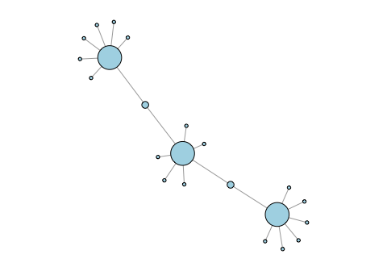
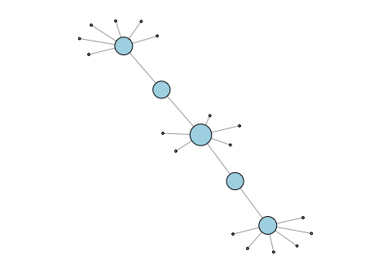
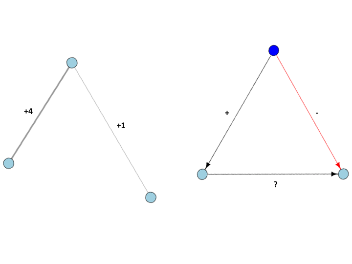
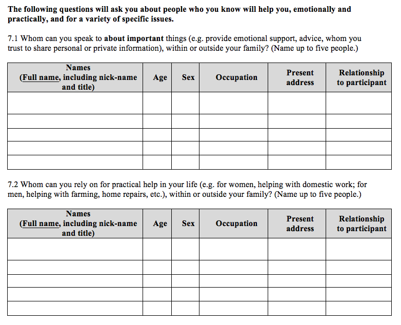
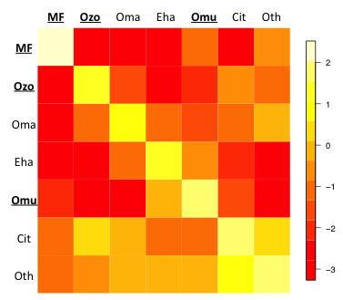

## Introduction to networks and network data collection

-   [Background to the study of social structure](#background-to-the-study-of-social-structure)
-   [Contextualizing SNA and relational data](#contextualizing-sna-and-relational-data)
-   [Network terminology](#network-terminology)
-   [Different types of networks](#different-types-of-networks)
-   [Basic node measurements](#basic-node-measurements)
-   [Basic network measurements](#basic-network-measurements)
-   [Basic edge measurements](#basic-edge-measurements)
-   [Network datasets](#network-datasets)
-   [Network data](#network-data)
    -   [Problems to consider](#problems-to-consider)
    -   [Setting up surveys](#setting-up-surveys)
-   [Ethics and sensitivity](#ethics-and-sensitivity)
-   [Cleaning network data (is miserable)](#cleaning-network-data-is-miserable)
-   [Data flexibility](#data-flexibility)

Back to [main page](README.md).

### Background to the study of social structure

Modern social-network analysis (SNA) has its roots in anthropology, particularly structuralism (Radcliffe-Brown's *On Social Structure*, 1940).

-   Make a scientific study of sociality by generalizing the particular: focus on systems, rather than culture
-   Social function: how a social behavior is related to the overall structure
    -   That A &lt;--&gt; B is not important
    -   How it forms a component of the whole structure
-   Thus, behaviors may be particular, but structure is somewhat predictable.
-   Study of social structure is not a deviation from natural science: physics (atomic); chemistry (molecular); biology (cellular); anthropology/ethology (social)

### Contextualizing SNA and relational data

-   Derived from structural anthropology, but utilized in many fields
-   Can measure network structure and/or simulate activity within a network
-   The SNA endeavor can be highly computational **AND** highly ethnographic
   
<!--<table>
<colgroup>
<col width="33%" />
<col width="18%" />
<col width="20%" />
<col width="27%" />
</colgroup>
<thead>
<tr class="header">
<th align="center">Methodological characteristics</th>
<th align="center">Data categories</th>
<th align="center">Description level</th>
<th align="center">Data-collection approach</th>
</tr>
</thead>
<tbody>
<tr class="even">
<td align="center">Quantitative</td>
<td align="center">Variable</td>
<td align="center">Individual</td>
<td align="center">Survey</td>
</tr>
<tr class="even">
<td align="center"> Network </td>
<td align="center"> Relational </td>
<td align="center"> Relationship </td>
<td align="center"> Survey / Ethnographic techniques / Observation </td>
</tr>
<tr class="even">
<td align="center">Qualitative</td>
<td align="center">Ideational</td>
<td align="center">Group</td>
<td align="center">Open interviews / Observation</td>
</tr>
</tbody>
</table>-->

### Network terminology

Basic terms to get familiar with:

-   node/vertex
-   edge/tie
-   graph

### Different types of networks

### Basic node measurements

As with non-relational datasets, before building statistical models, you should explore key features of your data.

Sometimes you may only need descriptives of your network---***it depends on your research question!***)

3 important nodal measurements to know and understand are:

1.  Degree

2.  Betweenness

3.  Closeness

### Basic network measurements

**Degree:** The number of contacts of node *n*.

**Betweenness:** The number of shortest paths between any other two nodes that *n* falls on.

**Closeness:**  The inverse of the sum of the shortest paths between *n* and every other node in the network. 

### Basic edge measurements

-   Weighted edges
-   Positive/negative ties

### Network datasets

-   Typically (but not obiligatorily) a field-collected "network" dataset is:
    -   ego-centric (as opposed to a complete sociomatrix)
    -   sampled
    -   cross-sectional
-   Thus, a sociomatrix (below) is rarely useful.

|            | ego | alter1 | alter2 | alter3 | alter4 | alter5 |
|:----------:|:---:|:------:|:------:|:------:|:------:|:------:|
|   **ego**  |  -  |    1   |    1   |    1   |    1   |    1   |
| **alter1** |  1  |    -   |    1   |    1   |    0   |    1   |
| **alter2** |  1  |    1   |    -   |    0   |    0   |    0   |
| **alter3** |  1  |    1   |    0   |    -   |    1   |    0   |
| **alter4** |  1  |    0   |    0   |    1   |    -   |    1   |
| **alter5** |  1  |    1   |    0   |    0   |    1   |    -   |

-   These characteristics reflect the tradeoffs of real-world data collection.
-   Their affect on data visualization and analysis must be strategized at the outset of data collection.

### Network data

Let's assume you are going to collect "typical" network data: ego-centric networks

You'll need to:

-   Construct an appropriate set of name-generator questions.
-   Select necessary/elicitable information about the contacts.
-   Get linking information about each contact for ego-network "scale-up."

#### Problems to consider

What if:

-   You cannot get full names of contacts.
-   Participants don't know much about their contacts.
-   You don't know what kinds of contacts are meaningful.

#### Setting up surveys

-   Network data collection can actually be a fairly messy endeavor.
-   Setting up your surveys to streamline the data prep step will save your sanity.
-   Different research objectives call for very different set-ups.

Let's look at a couple of examples...

**Highly structured**

**Less structured**

### Ethics and sensitivity

-   Relational data presents a special case for field and data-care ethics.
    -   You might be asking about senstive behaviors (sex, drugs, places they go, power dynamics).
    -   You are asking participants to talk about other people's behaviors.
    -   You have to store identifiable information.
-   Thinking like an ethnographer can be useful for improving reliability of responses.
-   Trust participants' ability to understand your research goals.
    -   **Show and tell** them what you're doing & why.

### Cleaning network data (is miserable)

-   From your sureys and fieldnotes, you will need to create:
    -   An edgelist: **A dataset of ties and relationship characteristics**
    -   A vertexlist: **A dataset of node characteristics**

<!---->

    ##       ego.id   alter.id relation
    ## 1 ETG-001-01 ETG-020-02        2
    ## 2 ETG-001-01 OKA-013-02        3
    ## 3 ETG-002-01  SP-005-02        2
    ## 4 ETG-002-01 ETG-015-02        2
    ## 5 ETG-002-01  SP-109-02        3
    ## 6 ETG-002-01  SP-047-02        3

    ##            id sex village region age.range tribe current
    ## 1 BANG-001-01   1    BANG      2         2     1       3
    ## 2 BANG-002-01   1    BANG      2         4     9       1
    ## 3 BANG-003-01   1     NDW      2         1     2       1
    ## 4 BANG-004-01   1    BANG      2         2     2     777
    ## 5 BANG-005-01   1    BANG      2         3     2       1
    ## 6 BANG-006-01   1    BANG      2         2     2       1

-   Common time-consuming data-cleaning steps
    -   Entity resolution
    -   Organizing name-generator questions

### Data flexibility

-   Network dataframes can be converted into matrices for different types of analyses.

Log-linear models of homophily

<!--Epidemic models requiring highly detailed contact structures
$$\\sum\_{j}(\\rho\_{k',ij}) = r\_{i}\\delta\_{i,j}+(1-r\_{i})(\\frac{(1-r\_{j})c\_{k',j}N\_{k',j}}{\\sum\_{j}(1-r\_{j})c\_{k',j}N\_{k',j})})$$
-   Travel/mobility or institutional data can be turned into bipartite networks. -->
