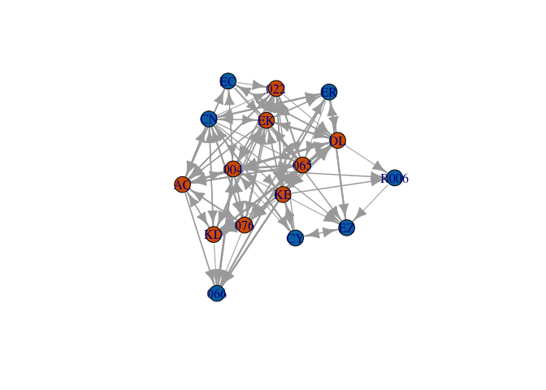
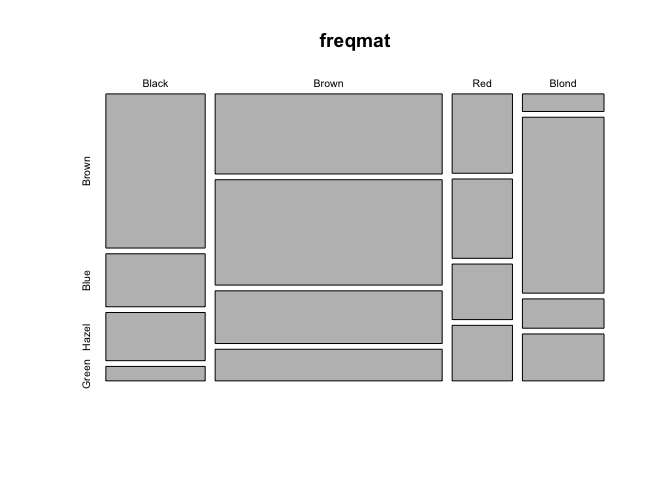
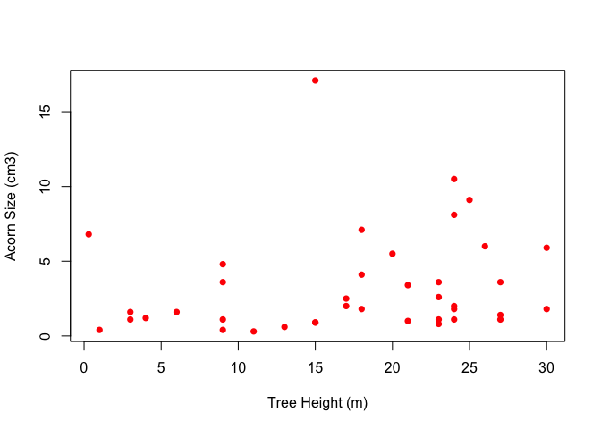
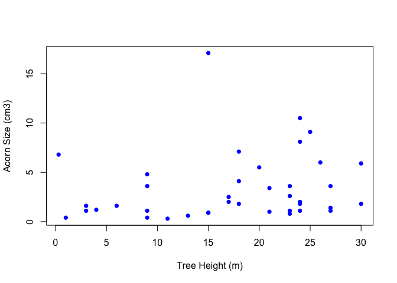
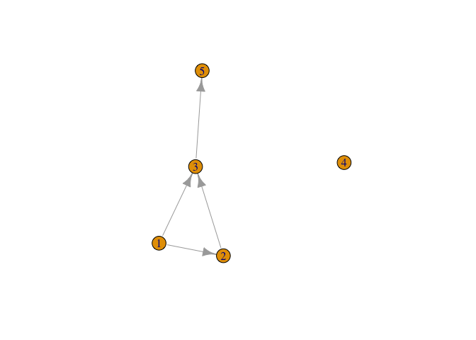

## Introduction to R

-   [What Is R?](#what-is-r)
-   [Why Use R?](#why-use-r)
-   [Wouldn't Something Menu-Driven Be Easier?](#wouldnt-something-menu-driven-be-easier)
-   [Rhesus Monkey Grooming Network](#rhesus-monkey-grooming-network)
-   [A Few Conventions and Other Helpful Bits](#a-few-conventions-and-other-helpful-bits)
-   [R as a Calculator](#r-as-a-calculator)
-   [Data Types](#data-types)
-   [Coercion](#coercion)
-   [Creating Vectors](#creating-vectors)
-   [Creating Matrices](#creating-matrices)
-   [Data Frames](#data-frames)
-   [Directories and Paths](#directories-and-paths)
-   [Reading Files](#reading-files)
-   [The Workspace](#the-workspace)
-   [Scope](#scope)
-   [Indexing and Subsetting](#indexing-and-subsetting)
-   [More Subsetting](#more-subsetting)
-   [Missing Values](#missing-values)
-   [Summarizing Data](#summarizing-data)
-   [Naming Data](#naming-data)
-   [Working on Lists](#working-on-lists)
-   [Flow Control: `if`](#flow-control-if)
-   [Flow Control: `for`](#flow-control-for)
-   [Using Packages](#using-packages)


Back to [main page](README.md).

### What Is R?

- `R` is statistical numerical software
- `R` is a "dialect" of the S statistical programming language
- `R` is a system for interactive data analysis
- `R` is a high-level programming language
- `R` is state-of-the-art in statistical computing. It is what many (most?) research statisticians use in their work

### Why Use R?

- `R` is FREE! That, by itself, is almost enough. No complicated licensing. Broad dissemination of research methodologies and results, etc.
- `R` is available for a variety of computer platforms (e.g., Linux, MacOS, Windows).
- `R` is widely used by professional statisticians, social scientists, biologists, demographers, and other scientists. This increases the likelihood that code will exist to do a calculation you might want to do.
- `R` has remarkable online help lists, tutorials, etc.
- `R` represents the state-of-the-art in statistical computing.

### Wouldn't Something Menu-Driven Be Easier?

- Fallacious thinking
- For teaching, text-based input is always better
- Example code can be copied and input *exactly*; you can then tweak it and see what happens, facilitating the learning process
- An example
- What follows is a pretty complicated graph of the grooming interactions of a group of rhesus monkeys, *Macaca mulatta*, observed by Sade (1972)
- With the code I used to generate this graph, you can recreate the figure *exactly*. Try it! It doesn't matter if you have no idea what you're doing yet. That's the point.
- The only thing you need to make this figure is to install and load the library `igraph`

### Rhesus Monkey Grooming Network

``` r
require(igraph)
rhesus <- read.table("https://web.stanford.edu/class/earthsys214/data/sade1.txt", 
                     skip=1, header=FALSE)
rhesus <- as.matrix(rhesus)
nms <- c("066", "R006", "CN", "ER", "CY", "EC", "EZ", "004", "065", "022", "076", 
         "AC", "EK", "DL", "KD", "KE")
sex <- c(rep("M",7), rep("F",9))
dimnames(rhesus)[[1]] <- nms
dimnames(rhesus)[[2]] <- nms
grhesus <- graph_from_adjacency_matrix(rhesus, weighted=TRUE)
V(grhesus)$sex <- sex

rhesus.layout <- layout.kamada.kawai(grhesus)
plot(grhesus, edge.width=log10(E(grhesus)$weight)+1, vertex.label=V(grhesus)$name,
     vertex.color=as.numeric(V(grhesus)$sex=="F")+5, layout=rhesus.layout)
```


### A Few Conventions and Other Helpful Bits

-   There are some things that you will see over and over in the code embedded in this document
-   The assignment operator `<-` is used to assign a value to a name.
-   The value is on the right-hand side of the operator and the name is on the left side
-   You can use `=` for assignment, but I don't recommend it (it doesn't work at all levels, makes the code harder to read, etc.)
-   Different environments make it more or less easy to use `<-`. In `RStudio`, hit the option key and the minus sign simultaneously
-   Comments are marked by `#`: anything following the hash will be ignored by `R`
-   Use comments liberally to help you (and others) understand your code
-   In these notes, the output that you would see on your own command line is marked in the grey box with two (non-italic) hashes, \# \#
-   Sometimes I enclose a command in parentheses; this is simply to force `R` to echo the output (for pedagogical purposes)

``` r
# a comment
x <- c(1,2,3)
(y <- c(1,2,3))
```

    ## [1] 1 2 3

-   You will probably want to seek help on functions. At the command line, simply type a question mark followed immediately by the function you want to query, `?function.name`
-   When you are done with your `R` session, type `q()` at the command line
-   `R` will ask you if you want to save your workspace. For now, you probably don't.
-   Check out the much more comprehensive [Introduction to R](https://cran.r-project.org/doc/manuals/r-release/R-intro.html) for all the language details.

### `R` as a Calculator

``` r
# addition
2+2
```

    ## [1] 4

``` r
# multiplication
2*3
```

    ## [1] 6

``` r
a <- 2
b <- 3
a*b
```

    ## [1] 6

``` r
# division
2/3
```

    ## [1] 0.6666667

``` r
b/a
```

    ## [1] 1.5

``` r
1/b/a
```

    ## [1] 0.1666667

``` r
# note order of operations!
1/(b/a)
```

    ## [1] 0.6666667

``` r
# parentheses can override order of operations
# an exponential
exp(-2)
```

    ## [1] 0.1353353

``` r
# why we age
r <- 0.02
exp(-r*45)
```

    ## [1] 0.4065697

``` r
# something more tricky
exp(log(2))
```

    ## [1] 2

``` r
# generate 20 normally distributed random numbers
rnorm(20)
```

    ##  [1] -1.1557722  0.2570493  1.2948309 -1.2080677  0.3102673  0.3369799
    ##  [7]  0.6387551  0.4450958  0.7512179 -1.2697104 -1.6181953  2.4480412
    ## [13]  0.4990785  1.5609338 -0.7308042 -0.2782639 -1.4443380  0.9956934
    ## [19] -2.0220970 -1.7860527

### Data Types

#### Numeric  
All numbers in `R` are of the form double (i.e., double-precision floating point numbers). This can be a bit confusing for people who are used to languages with integer data types (like, most languages!). Entering something that looks like an integer doesn't mean it is.

``` r
# it looks like an integer, but don't be fooled!
a <- 2
is.numeric(a)
```

    ## [1] TRUE

``` r
is.integer(a)
```

    ## [1] FALSE

``` r
is.double(a)
```

    ## [1] TRUE

#### Integer  
OK, technically `R` does have an integer class, but it is used very rarely and many functions will convert integers into doubles anyway. If you really must have an integer (e.g., because you are passing output to external C or FORTRAN code that expects it), add the suffix `L` to the entered number.

``` r
a <- 2L
is.integer(a)
```

    ## [1] TRUE

#### Character  
Strings are represented by the character data class.

``` r
(countries <- c("Uganda", "Tanzania", "Kenya", "Rwanda"))
```

    ## [1] "Uganda"   "Tanzania" "Kenya"    "Rwanda"

``` r
as.character(1:5)
```

    ## [1] "1" "2" "3" "4" "5"

### Factor  
Factors are a data type for encoding categorical data. Notice that factors are printed without the quotes. This is because R stores them as a set of codes. Data of type "factor" are different from data of type "character" (which is what plain text is). Note the difference below between factor and character data. Because factors get used in statistical models, they are actually represented as numbers (the levels) that have associated names. Vectors, on the other hand, are just lists of numbers.

``` r
countries <- factor(c("Uganda", "Tanzania", "Kenya", "Rwanda"))
countries
```

    ## [1] Uganda   Tanzania Kenya    Rwanda  
    ## Levels: Kenya Rwanda Tanzania Uganda

``` r
# a trick to get some insight into how factors are handled by R
unclass(countries)
```

    ## [1] 4 3 1 2
    ## attr(,"levels")
    ## [1] "Kenya"    "Rwanda"   "Tanzania" "Uganda"

``` r
countries1 <- c("Uganda", "Tanzania", "Kenya", "Rwanda")
countries1 == unclass(countries1)
```

    ## [1] TRUE TRUE TRUE TRUE

``` r
countries == unclass(countries)
```

    ## [1] FALSE FALSE FALSE FALSE

#### Logical  
`TRUE` and `FALSE` are reserved keywords, while `T` and `F` are global constants set to these. These logical variables are essential tools for subsetting data. You also use them extensively in setting optional arguments of functions.

``` r
t.or.f <- c(T,F,F,T,T)
is.logical(t.or.f)
```

    ## [1] TRUE

``` r
aaa <- c(1,2,3,4,5)
# subset
aaa[t.or.f]
```

    ## [1] 1 4 5

#### List  
You can mix different types of data in a list using the command `list()`. This is useful when you write your own functions and want to output multiple things. Use the function `str()` to give you information about a list.

``` r
child1 <- list(name="mary", child.age=6,
status="foster",mother.alive=F, father.alive=T, parents.ages=c(24,35))
str(child1)
```

    ## List of 6
    ##  $ name        : chr "mary"
    ##  $ child.age   : num 6
    ##  $ status      : chr "foster"
    ##  $ mother.alive: logi FALSE
    ##  $ father.alive: logi TRUE
    ##  $ parents.ages: num [1:2] 24 35

### Coercion

-   Sometimes you have data in one type but need it in a different type
-   `R` provides a variety of methods to coerce data from one type to another
-   These methods are carried out by functions that begin with `as.xxx`, where `xxx` is the data type to which you are coercing

``` r
countries <- factor(c("Uganda", "Tanzania", "Kenya", "Rwanda"))
as.character(countries)
```

    ## [1] "Uganda"   "Tanzania" "Kenya"    "Rwanda"

``` r
as.numeric(countries)
```

    ## [1] 4 3 1 2

``` r
# werk it backwards
countries1 <- c("Uganda", "Tanzania", "Kenya", "Rwanda")
as.factor(countries1)
```

    ## [1] Uganda   Tanzania Kenya    Rwanda  
    ## Levels: Kenya Rwanda Tanzania Uganda

``` r
# sometimes you want your numbers to actually be strings (e.g., when you make labels or column names)
as.character(1:5)
```

    ## [1] "1" "2" "3" "4" "5"

``` r
# there actually is an integer class; it just doesn't get used much at all
a <- 2
is.integer(a)
```

    ## [1] FALSE

``` r
is.integer(as.integer(a))
```

    ## [1] TRUE

-   You can check the class of an object using functions that begin with `is.xxx`, where `xxx` is the data type you are querying (like `is.integer()` above)

### Creating Vectors

-   A vector is a list of numbers -- it turns out everything in `R` is represented as a vector but that doesn't affect your life much.
-   In order to create a vector, you use the the function `c()`, which concatenates a list of items (hence the "c").
-   You will use this a lot and it's a super-common mistake to forget the `c()` when putting together a list of numbers, factors, etc.
-   If you do forget it, you will get a syntax error
-   Often we want either regularly spaced vectors or a vector of one value repeated. `R` has a number of facilities to perform these operations.

``` r
( manual <- c(1,3,5,7,9))
```

    ## [1] 1 3 5 7 9

``` r
( count <- 1:20 )
```

    ##  [1]  1  2  3  4  5  6  7  8  9 10 11 12 13 14 15 16 17 18 19 20

``` r
( ages <- seq(0,85,by=5) )
```

    ##  [1]  0  5 10 15 20 25 30 35 40 45 50 55 60 65 70 75 80 85

``` r
( ones <- rep(1,10) )
```

    ##  [1] 1 1 1 1 1 1 1 1 1 1

``` r
( fourages <- rep(c(1,2),c(5,10)) )
```

    ##  [1] 1 1 1 1 1 2 2 2 2 2 2 2 2 2 2

``` r
( equalspace <- seq(1,5, length=20) )
```

    ##  [1] 1.000000 1.210526 1.421053 1.631579 1.842105 2.052632 2.263158
    ##  [8] 2.473684 2.684211 2.894737 3.105263 3.315789 3.526316 3.736842
    ## [15] 3.947368 4.157895 4.368421 4.578947 4.789474 5.000000

-   You can use `rep()` to repeat values.
-   Sometimes this can be tricky: the second argument tells `R` how many repetitions.
-   This argument can be a vector and this, along with the possibility of a vector of the items you want repeated too, allows you to create quite complex patterns very easily.

``` r
rep(2,10)
```

    ##  [1] 2 2 2 2 2 2 2 2 2 2

``` r
rep(c(1,2),10)
```

    ##  [1] 1 2 1 2 1 2 1 2 1 2 1 2 1 2 1 2 1 2 1 2

``` r
rep(c(1,2), c(5,10))
```

    ##  [1] 1 1 1 1 1 2 2 2 2 2 2 2 2 2 2

``` r
rep("R roolz!", 3)
```

    ## [1] "R roolz!" "R roolz!" "R roolz!"

### Creating Matrices

-   As we said, a vector is a list of numbers
-   A matrix is a rectangular array of numbers -- it is a vector of vectors, with the numbers indexed by row and column.
-   One way to create matrices is to "bind" columns together using the commands `cbind()` or `rbind()`.

``` r
# age distribution of Gombe chimps in 1980 and 1986
cx1980 <- c(7, 13, 8, 13, 5, 35, 9)
cx1988 <- c(9, 11, 15, 8, 9, 38, 0)
( C <- cbind(cx1980, cx1988) )
```

    ##      cx1980 cx1988
    ## [1,]      7      9
    ## [2,]     13     11
    ## [3,]      8     15
    ## [4,]     13      8
    ## [5,]      5      9
    ## [6,]     35     38
    ## [7,]      9      0

``` r
# another way
C <- c(cx1980, cx1988)
(  C <- matrix(C, nrow=7, ncol=2) )
```

    ##      [,1] [,2]
    ## [1,]    7    9
    ## [2,]   13   11
    ## [3,]    8   15
    ## [4,]   13    8
    ## [5,]    5    9
    ## [6,]   35   38
    ## [7,]    9    0

-   What happens if we try to bind columns of different lengths?

``` r
# age distribution at Tai; Boesch uses fewer age classes
cx.boesch <- c(18,10,15,30)
( C <- cbind(C,cx.boesch) )
```

    ## Warning in cbind(C, cx.boesch): number of rows of result is not a multiple
    ## of vector length (arg 2)

    ##            cx.boesch
    ## [1,]  7  9        18
    ## [2,] 13 11        10
    ## [3,]  8 15        15
    ## [4,] 13  8        30
    ## [5,]  5  9        18
    ## [6,] 35 38        10
    ## [7,]  9  0        15

-   Both the warning message and the output can seem a little odd to the uninitiated
-   `R` uses a recycling rule for filling out vectors and matrices
-   When you try to put together things that are neither the same length nor multiples of each other, you get a warning
-   We can use the recycling rule to make a matrix of ones:

``` r
( X <- matrix(1,nr=3,nc=3) )
```

    ##      [,1] [,2] [,3]
    ## [1,]    1    1    1
    ## [2,]    1    1    1
    ## [3,]    1    1    1

-   Note that using the short version of `nrow`, `nr`, is sufficient. This is often true -- you can use the minimum name that is unambiguous.
-   The `matrix()` command requires at least 3 arguments: (1) a vector of numbers that will form the elements of the matrix, (2) the number of rows, and (3) the number of columns.
-   For small matrices, you might want to enter the vectors of values manually
-   If you do this, it's important to know that `R` fills matrices column-wise (the standard for FORTRAN and definitely not the way most people actually work!).
-   Use the optional argument `byrow=TRUE` to make `R` read in the data row-wise

``` r
# cross-classified data on hair/eye color 
freq <- c(32,11,10,3,  38,50,25,15,  10,10,7,7,  3,30,5,8)
hair <- c("Black", "Brown", "Red", "Blond")
eyes <- c("Brown", "Blue", "Hazel", "Green")
freqmat <- matrix(freq, nr=4, nc=4, byrow=TRUE)
dimnames(freqmat)[[1]] <- hair
dimnames(freqmat)[[2]] <- eyes
freqmat
```

    ##       Brown Blue Hazel Green
    ## Black    32   11    10     3
    ## Brown    38   50    25    15
    ## Red      10   10     7     7
    ## Blond     3   30     5     8

``` r
# might as well do something with it
mosaicplot(freqmat)
```



### Data Frames

-   A data frame is an `R` object which stores a data matrix. A data frame is essentially a list of variables which are all the same length. A single data frame can hold different types of variables.
-   To access a variable contained in a data frame, use the data frame name followed by the variable name, separated by a dollar sign, `$`.

``` r
# five columns of data
satu <- c(1,2,3,4,5)
dua <- c("a","b","c","d","e")
tiga <- sample(c(TRUE,FALSE),5,replace=TRUE)
empat <- LETTERS[7:11]
lima <- rnorm(5)
# construct a data frame
(collection <- data.frame(satu,dua,tiga,empat,lima))
```

    ##   satu dua  tiga empat       lima
    ## 1    1   a  TRUE     G -0.6938473
    ## 2    2   b  TRUE     H -0.0320666
    ## 3    3   c FALSE     I -0.5536300
    ## 4    4   d  TRUE     J -1.2437099
    ## 5    5   e FALSE     K  0.4473392

``` r
# extract the third variable
collection$tiga
```

    ## [1]  TRUE  TRUE FALSE  TRUE FALSE

-   by default, `data.frame()` will produce row numbers (seen to the left of the first column in the data frame `collection` above)

### Directories and Paths

-   `R` uses a working directory. The default can be set in the Preferences or using an initialization file (i.e., a file that is always read when `R` starts up).
-   If you read in a file without specifying a path, `R` will search in the working directory; if there is no file matching the name you provide, you receive an error message
-   We can query the working directory using the command `getwd()` and we can change it using `setwd()`
-   You can always load a file by giving either a full or relative path

``` r
getwd()
setwd("/Users/jhj1/Teaching/social_networks/")
```

-   When you quit `R`, you will be asked if you want to save your `R` session
-   If a session has previously been saved in your working directory, there will be a copy of the workspace in the `R` binary format named `.RData`
-   When `R` is started in a particular directory, if there is an `.RData` file in that directory, it will load automatically
-   This can lead to some surprising behavior if you don't know that it can happen

### Reading Files

-   There are a number of ways to read data into R. Probably the easiest and most frequently used involves reading data from plain-text (ASCII) files. These files can be space, tab, or comma delimited.
-   You can create these files in a spreadsheet program like Excel or output them from most other statistical packages.
-   You can read these from a local directory or from an internet source
-   `R` expects delimited files to be "white-space delimited" with values separated by either tabs or spaces and rows separated by carriage returns
-   It's always a good idea to specify whether or not you have a header (i.e., column names). If you don't, say `header=FALSE`; if you do, obviously, say `header=TRUE`

``` r
# read a space-delimitted file (a sociomatrix of kids 17 kids aggressive acts toward each other)
(kids <- read.table("https://web.stanford.edu/class/earthsys214/data/strayer_strayer1976-fig2.txt", header=FALSE))
```

    ##    V1 V2 V3 V4 V5 V6 V7 V8 V9 V10 V11 V12 V13 V14 V15 V16 V17
    ## 1   0  1  3  4  1  0  0  1  1   0   1   0   7   0   1   0   0
    ## 2   1  0  7  8  2  1  1 12  3   0   1   1   4   1   0   0   2
    ## 3   1  4  0  7  3  2  2  0  1   0   8   1   5   5   0   0   1
    ## 4   3  3  2  0  3  1 13  3  5   1   0   0   8   3   0   2   1
    ## 5   1  0  0  3  0  4  6  0  8   5   1   0   1   3   0   2   1
    ## 6   0  0  0  0  0  0  2  8 11   0   4   0   4   3   0   1   0
    ## 7   1  0  1  9  3  4  0  2  0   0   1   0   7   9   1   1   0
    ## 8   0  0  0  1  1  1  2  0  7   5   1   1   1   0   0   0   0
    ## 9   1  1  1  2  5 11  0  3  0   0   0   0   1   0   0   0   0
    ## 10  0  0  0  0  0  0  1  0  0   0   0  11   0   1   0   1   4
    ## 11  4  0  4  3  3  2  1  0  0   0   0   3  11   5   0   2   2
    ## 12  0  0  0  0  0  0  0  0  0   2   0   0   2   0   8   0   0
    ## 13  0  1  9  3  0  3  6  0  0   0  11   2   0   1   0   7   5
    ## 14  0  1  4  0  1  2  1  0  0   0   1   0   1   0   0   0   0
    ## 15  0  0  0  0  0  0  0  0  0   0   0   3   0   0   0   0   0
    ## 16  0  0  0  0  0  1  0  0  0   0   0   1   1   0   0   0   0
    ## 17  0  0  0  0  0  0  0  0  1   1   0   0   0   0   0   0   0

-   If your file is delimited by something other than spaces, it is a good idea to use a slightly different function, `read.delim()` and specify exactly what the delimiter is

-   Frequently, there will be non-tabular information at the top of a file (e.g., meta-data describing the data set). Use the `skip=n` option, where `n` is the number of lines you want skipped.

``` r
quercus <- read.delim("https://web.stanford.edu/class/earthsys214/data/quercus.txt", skip=24, sep="\t", header=TRUE)
head(quercus)
```

    ##                     Species   Region Range acorn.size tree.height
    ## 1           Quercus alba L. Atlantic 24196        1.4          27
    ## 2  Quercus bicolor Willd.   Atlantic  7900        3.4          21
    ## 3 Quercus macrocarpa Michx. Atlantic 23038        9.1          25
    ## 4  Quercus prinoides Willd. Atlantic 17042        1.6           3
    ## 5         Quercus Prinus L. Atlantic  7646       10.5          24
    ## 6    Quercus stellata Wang. Atlantic 19938        2.5          17

### The Workspace

-   `R` handles data in a manner that is different than many statistical packages.
-   In particular, you are not limited to a single rectangular data matrix at a time.
-   The workspace holds all the objects (e.g., data frames, variables, functions) that you have created or read in.
-   You can essentially have as many data frames as your machine's memory will allow.
-   To find out what lurks in your workspace, use `objects()` command.
-   To remove an object, use `rm()`.
-   If you *really* want to clear your whole workspace, you can use the following syntax: `rm(list=ls())`. **Beware, though. Once you do this, you don't get the data back.**

``` r
objects()
```

    ##  [1] "a"             "aaa"           "ages"          "b"            
    ##  [5] "C"             "child1"        "collection"    "count"        
    ##  [9] "countries"     "countries1"    "cx.boesch"     "cx1980"       
    ## [13] "cx1988"        "dua"           "empat"         "equalspace"   
    ## [17] "eyes"          "fourages"      "freq"          "freqmat"      
    ## [21] "grhesus"       "hair"          "kids"          "lima"         
    ## [25] "manual"        "nms"           "ones"          "quercus"      
    ## [29] "r"             "rhesus"        "rhesus.layout" "satu"         
    ## [33] "sex"           "t.or.f"        "tiga"          "x"            
    ## [37] "X"             "y"

``` r
rm(aaa)
rm(list=ls())
objects()
```

    ## character(0)

### Scope

-   Because the `R` workspace can contain many different variables and even multiple data frames, you must be aware of scope
-   When we extract columns of a data frame (e.g., if we wanted to plot them) we need to use the syntax `data.frame$col.name`

``` r
quercus <- read.delim("https://web.stanford.edu/class/earthsys214/data/quercus.txt", skip=24, sep="\t", header=TRUE)
plot(quercus$tree.height, quercus$acorn.size, pch=16, col="red", xlab="Tree Height (m)", ylab="Acorn Size (cm3)")
```



-   It can be a hassle having to type the data frame name (and dollar sign) over and over again
-   With the `with()` function, we can set up a local scoping rule that allows us to drop the need to type the data frame name (and dollar sign) to access columns of a data frame

``` r
quercus <- read.delim("https://web.stanford.edu/class/earthsys214/data/quercus.txt", skip=24, sep="\t", header=TRUE)
with(quercus, plot(tree.height, acorn.size, pch=16, col="blue", xlab="Tree Height (m)", ylab="Acorn Size (cm3)"))
```



-   Apparently, there are `R` users who gladly use `with` and those who hate its use. I fall into the former category.

### Indexing and Subsetting

-   Index (and access) the elements of a vector using square brackets. `myvec[1]` takes the first element of a vector called `myvec`.
-   Use the colon (:) operator for sequences. `myvec[1:5]` takes the first five elements of `myvec`.
-   `R` is unusual in that it allows negative indexing: `myvec[-1]` takes all elements of except the first one. To exclude a sequence, you need to place the sequence within parentheses: `myvec[-(1:5)]`.
-   Vector indices don't have to be consecutive: `myvec[c(2,5,1,11)]`.

``` r
myvec <- c(1,2,3,4,5,6,66,77,7,8,9,10)
myvec[1]
```

    ## [1] 1

``` r
myvec[1:5]
```

    ## [1] 1 2 3 4 5

``` r
myvec[-1]
```

    ##  [1]  2  3  4  5  6 66 77  7  8  9 10

``` r
myvec[-(1:5)]
```

    ## [1]  6 66 77  7  8  9 10

``` r
# try without the parentheses
#myvec[-1:5]
myvec[c(2,5,1,11)]
```

    ## [1] 2 5 1 9

-   Access the elements of a data frame using the dollar sign. Subsetting anything other than a data frame uses square brackets.

``` r
quercus <- read.delim("https://web.stanford.edu/class/earthsys214/data/quercus.txt", skip=24, sep="\t", header=TRUE)
dim(quercus)
```

    ## [1] 39  5

``` r
size <- quercus$acorn.size
size[1:3] #first 3 elements
```

    ## [1] 1.4 3.4 9.1

``` r
size[17]  #only element 17
```

    ## [1] 4.8

``` r
size[-39] #all but the last element
```

    ##  [1]  1.4  3.4  9.1  1.6 10.5  2.5  0.9  6.8  1.8  0.3  0.9  0.8  2.0  1.1
    ## [15]  0.6  1.8  4.8  1.1  3.6  1.1  1.1  3.6  8.1  3.6  1.8  0.4  1.1  1.2
    ## [29]  4.1  1.6  2.0  5.5  5.9  2.6  6.0  1.0 17.1  0.4

``` r
size[c(3,6,9)] # elements 3,6,9
```

    ## [1] 9.1 2.5 1.8

``` r
size[quercus$Region=="California"] # use a logical test to subset
```

    ##  [1]  4.1  1.6  2.0  5.5  5.9  2.6  6.0  1.0 17.1  0.4  7.1

``` r
quercus[3,4] # access an element of an array or data frame by X[row,col]
```

    ## [1] 9.1

``` r
quercus[,"tree.height"]
```

    ##  [1] 27.0 21.0 25.0  3.0 24.0 17.0 15.0  0.3 24.0 11.0 15.0 23.0 24.0  3.0
    ## [15] 13.0 30.0  9.0 27.0  9.0 24.0 23.0 27.0 24.0 23.0 18.0  9.0  9.0  4.0
    ## [29] 18.0  6.0 17.0 20.0 30.0 23.0 26.0 21.0 15.0  1.0 18.0

-   The comma with nothing in front of it means take every row in the column named `"tree.height"`.

### More Subsetting

-   Positive indices include, negative indices exclude elements
-   `1:3` means a sequence from 1 to 3
-   You can only use a single negative subscript, i.e., you can't use `quercus$acorn.size[-1:3]`
-   Of course, you can get around this by enclosing the vector in parentheses `quercus$acorn.size[-(1:3)]`
-   The logical operators are `==` (equal), `!=` (not equal), and the various greater than/less than symbols: `>`, `>=`, `<`, `<=`
-   Further logicals are `&` (and), `|` (or), `!`, `&&` (another and), `||` (another or)
-   `&` and `!` work elementwise on vectors: element 1 is compared in the two vectors, then element 2, and so on
-   `&&` and `||` are tricky. These logical tests evaluate left to right, examining only the first element of each vector (they go until a result is determined for `||`).
-   Why would you want that?? In general, you don't. It makes some calculations faster.
-   When you refer to a variable in a data frame, you must specify the data frame name followed a dollar sign and the variable name `quercus$acorn.size`
-   Testing for equality is just a special case of a logical test. We frequently want to identify numbers either above or below some criterion.

``` r
myvec <- c(1,2,3,4,5,6,66,77,7,8,9,10)
myvec <- myvec[myvec<=10]
myvec
```

    ##  [1]  1  2  3  4  5  6  7  8  9 10

``` r
x <- 1:7
# elements that are greater than 2 but less than 6
(x>2) & (x<6)
```

    ## [1] FALSE FALSE  TRUE  TRUE  TRUE FALSE FALSE

``` r
# this is not intuitive
(x>2) && (x<6)
```

    ## [1] FALSE

``` r
# but dis doe...
(x<2) && (x<6)
```

    ## [1] TRUE

``` r
is.even <- rep(c(FALSE, TRUE),5)
(evens <- myvec[is.even])
```

    ## [1]  2  4  6  8 10

### Missing Values

-   `NA` is a special code for missing data.
-   `NA` pretty much means "Don't Know."
-   The presence of `NA` values in your data set can lead to some surprising consequences when you work with it.
-   You can't test for a `NA` the way you would test for any other value (i.e., using the `==` operator) since `variable==NA` is like asking in English, is the variable equal to some number I don't know? How could you know that?!
-   It also doesn't make any sense to add one to something you don't know what it is -- `1+NA` is meaningless!
-   `R` therefore provides the function `is.na()` that allows us to subset using logicals.

``` r
aaa <- c(1,2,3,NA,4,5,6,NA,NA,7,8,9,NA,10)
aaa <- aaa[!is.na(aaa)]
aaa
```

    ##  [1]  1  2  3  4  5  6  7  8  9 10

-   Here we used the not-operator (`!`) to index everything that is *not* an `NA`
-   This is actually probably the most common way of using `is.na()`.

``` r
aaa <- c(1,2,3,NA,4,5,6,NA,NA,7,8,9,NA,10)
is.na(aaa)
```

    ##  [1] FALSE FALSE FALSE  TRUE FALSE FALSE FALSE  TRUE  TRUE FALSE FALSE
    ## [12] FALSE  TRUE FALSE

``` r
!is.na(aaa)
```

    ##  [1]  TRUE  TRUE  TRUE FALSE  TRUE  TRUE  TRUE FALSE FALSE  TRUE  TRUE
    ## [12]  TRUE FALSE  TRUE

-   There are a couple other special values of objects
-   One is `Inf`, which means "infinity."" It may result from dividing zero by zero.
-   Another is `NaN`, which means "not a number." You will get this is, e.g., you try to take a logarithm of a negative number.

### Summarizing Data

-   The function `table()` is a very useful way of exploring data

``` r
aaa <- rpois(100,5)
table(aaa)
```

    ## aaa
    ##  0  1  2  3  4  5  6  7  8  9 10 11 
    ##  1  7 11  9 17 18 14 10  8  3  1  1

``` r
donner <- read.table("https://web.stanford.edu/class/earthsys214/data/donner.dat", header=TRUE, skip=2)
# survival=0 == died; male=0 == female
with(donner, table(male,survival))
```

    ##     survival
    ## male  0  1
    ##    0  5 10
    ##    1 20 10

``` r
# table along 3 dimensions
with(donner, table(male,survival,age))
```

    ## , , age = 15
    ## 
    ##     survival
    ## male 0 1
    ##    0 0 1
    ##    1 1 0
    ## 
    ## , , age = 18
    ## 
    ##     survival
    ## male 0 1
    ##    0 0 0
    ##    1 0 1
    ## 
    ## , , age = 20
    ## 
    ##     survival
    ## male 0 1
    ##    0 0 1
    ##    1 0 1
    ## 
    ## , , age = 21
    ## 
    ##     survival
    ## male 0 1
    ##    0 0 1
    ##    1 0 0
    ## 
    ## , , age = 22
    ## 
    ##     survival
    ## male 0 1
    ##    0 0 1
    ##    1 0 0
    ## 
    ## , , age = 23
    ## 
    ##     survival
    ## male 0 1
    ##    0 0 1
    ##    1 2 1
    ## 
    ## , , age = 24
    ## 
    ##     survival
    ## male 0 1
    ##    0 0 1
    ##    1 1 0
    ## 
    ## , , age = 25
    ## 
    ##     survival
    ## male 0 1
    ##    0 1 1
    ##    1 5 1
    ## 
    ## , , age = 28
    ## 
    ##     survival
    ## male 0 1
    ##    0 0 0
    ##    1 2 2
    ## 
    ## , , age = 30
    ## 
    ##     survival
    ## male 0 1
    ##    0 0 0
    ##    1 3 1
    ## 
    ## , , age = 32
    ## 
    ##     survival
    ## male 0 1
    ##    0 0 2
    ##    1 0 1
    ## 
    ## , , age = 35
    ## 
    ##     survival
    ## male 0 1
    ##    0 0 0
    ##    1 1 0
    ## 
    ## , , age = 40
    ## 
    ##     survival
    ## male 0 1
    ##    0 0 1
    ##    1 1 1
    ## 
    ## , , age = 45
    ## 
    ##     survival
    ## male 0 1
    ##    0 2 0
    ##    1 0 0
    ## 
    ## , , age = 46
    ## 
    ##     survival
    ## male 0 1
    ##    0 0 0
    ##    1 0 1
    ## 
    ## , , age = 47
    ## 
    ##     survival
    ## male 0 1
    ##    0 1 0
    ##    1 0 0
    ## 
    ## , , age = 50
    ## 
    ##     survival
    ## male 0 1
    ##    0 1 0
    ##    1 0 0
    ## 
    ## , , age = 57
    ## 
    ##     survival
    ## male 0 1
    ##    0 0 0
    ##    1 1 0
    ## 
    ## , , age = 60
    ## 
    ##     survival
    ## male 0 1
    ##    0 0 0
    ##    1 1 0
    ## 
    ## , , age = 62
    ## 
    ##     survival
    ## male 0 1
    ##    0 0 0
    ##    1 1 0
    ## 
    ## , , age = 65
    ## 
    ##     survival
    ## male 0 1
    ##    0 0 0
    ##    1 1 0

``` r
cage <- rep(0,length(donner$age))
# simplify by defining 2 age classes: over/under 25
cage[donner$age<=25] <- 1
cage[donner$age>25] <- 2
donner <- data.frame(donner,cage=cage)
with(donner, table(male,survival,cage))
```

    ## , , cage = 1
    ## 
    ##     survival
    ## male  0  1
    ##    0  1  7
    ##    1  9  4
    ## 
    ## , , cage = 2
    ## 
    ##     survival
    ## male  0  1
    ##    0  4  3
    ##    1 11  6

-   It's sometimes useful to sort a vector

``` r
aaa <- rpois(100,5)
sort(aaa)
```

    ##   [1]  1  1  1  1  2  2  2  2  2  2  2  2  3  3  3  3  3  3  3  3  3  3  3
    ##  [24]  3  4  4  4  4  4  4  4  4  4  4  4  5  5  5  5  5  5  5  5  5  5  5
    ##  [47]  5  5  5  5  5  5  5  5  5  5  5  5  5  5  5  6  6  6  6  6  6  6  6
    ##  [70]  6  6  6  6  6  6  6  6  7  7  7  7  7  7  8  8  8  8  8  8  8  8  8
    ##  [93]  8  9  9  9  9 10 10 13

``` r
# decreasing order
sort(aaa,decreasing=TRUE)
```

    ##   [1] 13 10 10  9  9  9  9  8  8  8  8  8  8  8  8  8  8  7  7  7  7  7  7
    ##  [24]  6  6  6  6  6  6  6  6  6  6  6  6  6  6  6  6  5  5  5  5  5  5  5
    ##  [47]  5  5  5  5  5  5  5  5  5  5  5  5  5  5  5  5  5  5  5  4  4  4  4
    ##  [70]  4  4  4  4  4  4  4  3  3  3  3  3  3  3  3  3  3  3  3  2  2  2  2
    ##  [93]  2  2  2  2  1  1  1  1

-   Sorting data frames is a bit more involved, but still straightforward
-   use the function `order()`

``` r
# five columns of data again
satu <- c(1,2,3,4,5)
dua <- c("a","b","c","d","e")
tiga <- sample(c(TRUE,FALSE),5,replace=TRUE)
empat <- LETTERS[7:11]
lima <- rnorm(5)
# construct a data frame
(collection <- data.frame(satu,dua,tiga,empat,lima))
```

    ##   satu dua  tiga empat       lima
    ## 1    1   a FALSE     G  0.7277635
    ## 2    2   b  TRUE     H  2.0277277
    ## 3    3   c FALSE     I  1.9295619
    ## 4    4   d FALSE     J -0.1581232
    ## 5    5   e FALSE     K  1.4184415

``` r
o <- order(collection$lima)
collection[o,]
```

    ##   satu dua  tiga empat       lima
    ## 4    4   d FALSE     J -0.1581232
    ## 1    1   a FALSE     G  0.7277635
    ## 5    5   e FALSE     K  1.4184415
    ## 3    3   c FALSE     I  1.9295619
    ## 2    2   b  TRUE     H  2.0277277

### Naming Data

-   The matrix of aggressive interactions among kids had neither column nor row names
-   We can add the codes used in the Strayer and Strayer (1976) paper

``` r
kids <- read.table("https://web.stanford.edu/class/earthsys214/data/strayer_strayer1976-fig2.txt", header=FALSE)
kid.names <- c("Ro","Ss","Br","If","Td","Sd","Pe","Ir","Cs","Ka",
                "Ch","Ty","Gl","Sa", "Me","Ju","Sh")
colnames(kids) <- kid.names
rownames(kids) <- kid.names
```

-   `colnames()` and `rownames()` are convenience functions

-   A More General Method Will Be Presented Next Slide

### Working on Lists

-   `apply()` applies a function along the margins of a matrix
-   `lapply()` applies a function to a list and generates a list as its output
-   `sapply()` is similar to `lapply()` but generates a vector as its output

``` r
aaa <- list(alpha = 1:10, beta = rnorm(100), x = sample(1:100, 100, replace=TRUE))
lapply(aaa,mean)
```

    ## $alpha
    ## [1] 5.5
    ## 
    ## $beta
    ## [1] -0.1212708
    ## 
    ## $x
    ## [1] 50.72

``` r
# more compact as a vector
sapply(aaa,mean)
```

    ##      alpha       beta          x 
    ##  5.5000000 -0.1212708 50.7200000

``` r
# cross-tabulation of sex partners from NHSLS
sextable <- read.csv("https://web.stanford.edu/class/earthsys214/data/nhsls_sextable.txt", header=FALSE)
dimnames(sextable)[[1]] <- c("white","black","hispanic","asian","other")
dimnames(sextable)[[2]] <- c("white","black","hispanic","asian","other")
# calculate marginals
(row.sums <- apply(sextable,1,sum))
```

    ##    white    black hispanic    asian    other 
    ##     1177      278      158       26       26

``` r
(col.sums <- apply(sextable,2,sum))
```

    ##    white    black hispanic    asian    other 
    ##     1194      281      137       13       40

``` r
# using sapply() gives similar output
sapply(sextable,sum)
```

    ##    white    black hispanic    asian    other 
    ##     1194      281      137       13       40

``` r
# compare the output of sapply() to lapply()
lapply(sextable,sum)
```

    ## $white
    ## [1] 1194
    ## 
    ## $black
    ## [1] 281
    ## 
    ## $hispanic
    ## [1] 137
    ## 
    ## $asian
    ## [1] 13
    ## 
    ## $other
    ## [1] 40

### Flow Control: `if`

-   `if` allows you to conditionally evaluate expressions.
-   The basic syntax of an `if` statement is: `if(condition) true.branch else false.branch`
-   The `else` part of the statement is optional

``` r
(coin <- sample(c("heads","tails"),1))
```

    ## [1] "tails"

``` r
if(coin=="tails") b <- 1 else b <- 0
b
```

    ## [1] 1

-   Sometimes you can use the very efficient `ifelse` statement

``` r
x <- 4:-2
# sqrt(x) produces warnings, but using ifelse to check works without producing warings
sqrt(ifelse(x >= 0, x, NA))
```

    ## [1] 2.000000 1.732051 1.414214 1.000000 0.000000       NA       NA

### Flow Control: `for`

-   If you want to repeat an action over and over again you need a loop
-   Loops are mostly generated using `for` statements
-   The basic syntax of a `for` loop is: `for(item in sequence) statement(s)`

``` r
x <- 1:5
for(i in 1:5) print(x[i])
```

    ## [1] 1
    ## [1] 2
    ## [1] 3
    ## [1] 4
    ## [1] 5

-   That's a pretty silly `for` loop -- there are much more important uses of `for` loops!
-   If there are multiple statements executed by a `for` loop, those statements must be enclosed in curly braces, `{}`
-   We need to be careful with `for` loops because they can slow code down, particularly when they are nested and the number of iterations is very large.
-   Vectorizing and using mapping functions like `apply` and its relatives can greatly speed your code up

### Using Packages

-   Much of the functionality of R comes from the many contributed packages
-   To use a package, you must first install it
-   This can be done at the command line using `install.packages(package.name)`
-   It is often more convenient to use a menu command
-   in `RStudio` this is under `Tools>Install Packages...`
-   Once a package is installed, you must load it in order to use it
-   Do this using the `library()` command

``` r
library(igraph)
# might as well do something with it
# a small graph
g <- graph( c(1,2, 1,3, 2,3, 3,5), n=5 )
plot(g)
```


