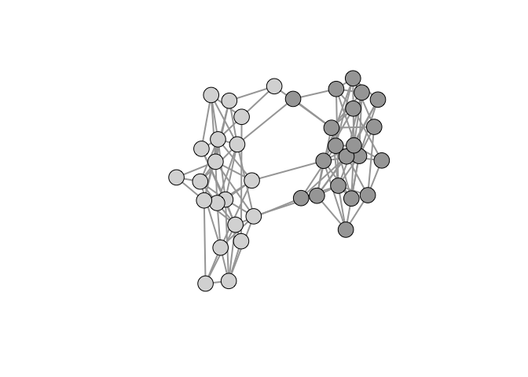
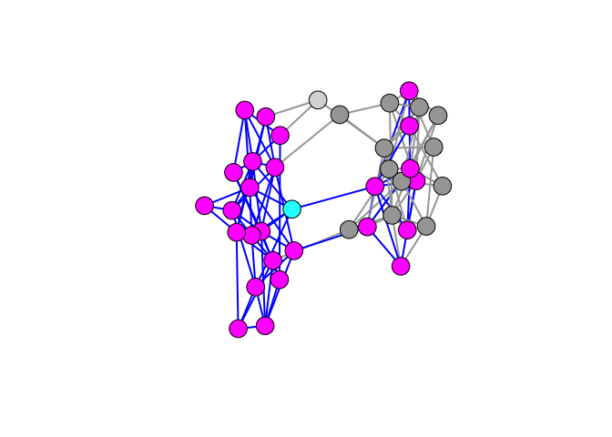

When plotting graphs, we frequently want to identify some induced subgraph. This might be an ego network or a path such as a link-tracing sample or geodesic.

This can be tricky, particularly if the graph is large. Here are a couple of hacks that help.

We can illustrate how to do this using an example discussed in Jones et al. (2018). We have two small villages of 20 people each. Connections within the village are quite dense (approximately 0.3). There are a few connections between the villages as well. The goal is to find high-betweenness individuals -- i.e., those who connect communities -- based on a random walk along the network (Salathé and Jones 2010). We will start with a vertex we know to have high centrality to illustrate how we plot an ego network embedded within a larger graph.

``` r
library(igraph)
set.seed(8675309)
## two dense communities
g1 <- sample_gnm(20,60)
g2 <- sample_gnm(20,55)
gg <- g1 %du% g2

## add links across communities
s1 <- sample(1:20,5,replace=FALSE)
s2 <- sample(21:40,5,replace=FALSE)
gg <- add_edges(gg,c(rbind(s1,s2)))

## plotting
cols <- c(rep(grey(0.65),20), rep(grey(0.85),20))
ecols <- rep("#A6A6A6",120)
lay <- layout_with_fr(gg)

plot(gg,vertex.color=cols,vertex.label=NA,edge.width=2,edge.color=ecols,
     layout=lay)
```



Suppose we want to highlight an ego network embedded within a larger graph. We can use the function `make_ego_graph()` to extract the ego network but it will renumber all the vertices and edges, making it useless for subsetting the larger graph for visualization. The key piece of information is that functions like `make_ego_graph()` and `induced_subgraph()` retain all the vertex/edge covariate values of the original graph. We can therefore construct vertex and edge counters and assign these as attributes.

This is probably considered a feature, but it can feel more like a bug if you're not expecting it. `make_ego_graph()` returns a list regardless of how many vertices you give it in the `nodes` argument. You need to extract the graph object using double square brackets, as usual for extracting list elements.

Pick a vertex -- say vertex 33 -- and calculate its second-order ego network (i.e., all of 33's connections plus all their connections). We will color ego (i.e., node 33) cyan, ego's second-order ego network magenta and ties within the ego network blue. Everything else remains the same.

``` r
E(gg)$id <- seq_len(ecount(gg))
V(gg)$vid <- seq_len(vcount(gg))
ego33_2 <- make_ego_graph(gg,order=2,nodes=33)
ego33_2 <- ego33_2[[1]]

cols1 <- cols
cols1[V(ego33_2)$vid] <- "magenta"
cols1[33] <- "cyan"
ecols1 <- ecols
ecols1[E(ego33_2)$id] <- "blue"
plot(gg,vertex.color=cols1,vertex.label=NA,edge.width=2,edge.color=ecols1,
     layout=lay)
```



We can see that in a dense, small network, nearly every vertex in ego's community falls within her second-order ego network.

Jones, J.H., A. Hazel, and N. Rimi. 2018. “Taming the Ethnographic Porcupine: Common Missing Data Problems in Anthropological Networks.” *Network Science* submitted.

Salathé, M., and J. H. Jones. 2010. “Dynamics and Control of Diseases in Networks with Community Structure.” *PLoS Computational Biology* 6 (4): e1000736. doi:[10.1371/journal.pcbi.1000736](https://doi.org/10.1371/journal.pcbi.1000736).
